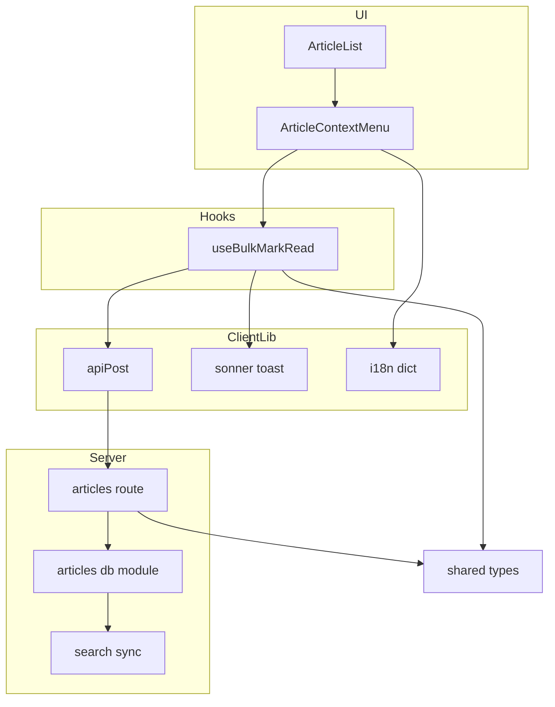
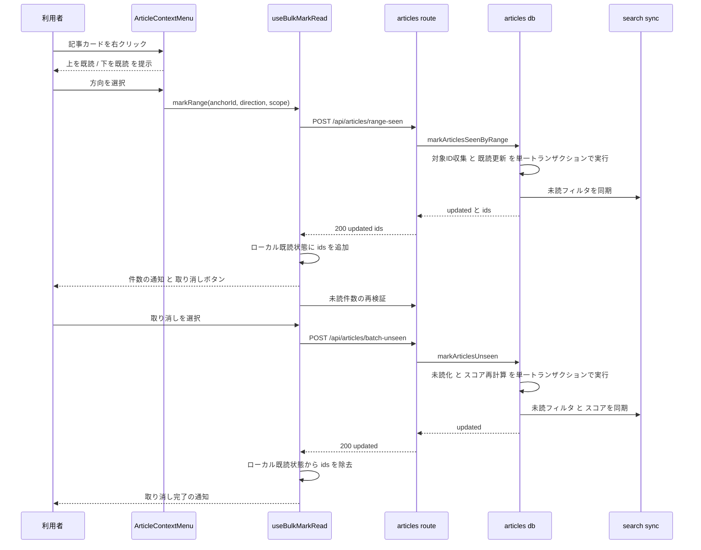
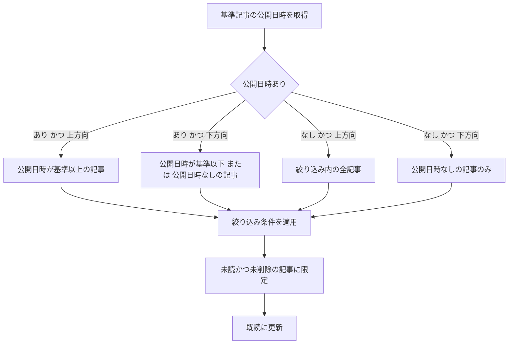

# Technical Design: bulk-mark-read

## Overview

**Purpose**: 記事一覧で任意の記事を基準に、それより新しい記事または古い記事をまとめて既読にする手段を提供する。

**Users**: 未読記事をタイトルで上から順に確認し、途中で確認を打ち切る利用者が、Inbox、フィード別(クリップを含む)、およびカテゴリ別の記事一覧で利用する。

**Impact**: 既読操作の入口として、記事カードに右クリックメニューを新設する。サーバーには「基準記事と方向から対象を解決して既読にする」操作と「指定した記事群を未読に戻す」操作を追加する。既存の既読データモデル、記事一覧の並び順、smart floor の算出には手を入れない。`getArticles` の絞り込み条件生成のみ、振る舞いを変えずに関数として切り出して共有する。

### Goals

- 現在の絞り込み条件に一致する記事のうち、基準記事と同じ位置またはそれより前/後にある未読記事を、一度の操作で全て既読にする
- 一覧にまだ読み込まれていない記事と、smart floor によって表示されていない古い記事も対象に含める
- 実行結果を件数で通知し、その操作で新たに既読にした記事だけを取り消せるようにする
- 既存の既読操作(単一既読、スクロール自動既読、フィード全体の既読)と矛盾しない状態遷移を保つ

### Non-Goals

- 右クリック以外の呼び出し手段(メニューアイコン、スワイプ、キーボードショートカット)
- ブックマーク、お気に入り、既読済みのコレクション表示での提供
- 既読以外の一括操作(未読化の単独操作、ブックマーク、いいね、削除)
- 通信が利用できない状態での操作の保留と後送
- 記事一覧の並び順への第2ソートキーの導入

## Boundary Commitments

### This Spec Owns

- 基準記事・方向・絞り込み条件から対象記事集合を決定する規則
- 対象記事集合を既読にする操作と、その結果として新たに既読になった記事IDの返却
- 指定された記事群を未読に戻す操作
- 記事カードの右クリックメニューの提示と、その項目の文言
- 一括既読の結果通知と取り消しの提示、および操作後のローカル表示更新
- `getArticles` から切り出す絞り込み条件生成関数の定義と、その呼び出し規約
- デモモードにおける上記2操作の等価な振る舞い

### Out of Boundary

- 既読状態のデータモデル(`seen_at` / `read_at` の意味と列定義)
- 記事一覧の並び順の決定規則と smart floor の算出ロジック
- 未読件数の算出方法と、その配信経路
- 検索インデックスの同期機構そのもの
- スクロール自動既読の判定条件とバッチ送信の間隔
- オフラインキュー(`src/lib/offlineQueue.ts`)の対象拡張

### Allowed Dependencies

- サーバー: `server/db/articles.ts` の既存の既読更新・スコア再計算・検索同期ヘルパー、`server/lib/validation.ts` の `parseOrBadRequest`、`server/auth.ts` の `requireJson`
- クライアント: `src/components/ui/context-menu.tsx`、`src/lib/fetcher.ts` の `apiPost`、`src/lib/i18n.ts`、`sonner` の `toast`、SWR の `useSWRConfig`
- 共有: `shared/types.ts` に定義する要求・応答型

依存の向き: `shared/types` → `server/db` → `server/routes`、および `shared/types` → `src/lib` → `src/hooks` → `src/components`。この向きを逆流する import は許容しない。とくに `server/db/articles.ts` が `server/routes` を参照してはならない。

### Revalidation Triggers

- `getArticles` の絞り込み条件、並び順、または smart floor の適用条件が変わったとき。一括既読の対象決定が一覧の見た目とずれる
- `seen_at` の更新規則(秒精度、既読済みの上書き有無)が変わったとき
- 記事一覧が `sort` クエリを送るようになったとき。方向判定の基準列が `published_at` でなくなる
- 右クリックメニューの対象画面がお気に入り表示または既読済み表示に広がったとき。並び順が `liked_at` / `read_at` になり、方向判定の前提が崩れる
- デモモードの API 横取り構成が変わったとき

## Architecture

### Existing Architecture Analysis

記事一覧は `useSWRInfinite` で `/api/articles` をページ単位に取得し、クエリパラメータで絞り込みを表現する。サーバーは `getArticles` が絞り込み条件・並び順・smart floor をまとめて組み立て、1つの SQL に展開する。

既読更新は `server/db/articles.ts` に集約されている。`markAllSeenByFeed` が確立したパターンは3手順で、更新前に対象IDを収集し、`seen_at IS NULL` の行だけを更新し、更新後に `syncArticleFiltersToSearch` で検索インデックスへ未読状態を反映する。未読化はさらに `updateScoreDb` によるスコア再計算と `syncScoreToSearch` をともなう。スコア式が `read_at` を参照するため、この再計算は省略できない。

記事一覧は `autoReadIds` というローカル状態を持ち、スクロール自動既読で既読にした記事を一覧から消さずに既読の見た目へ切り替えている。本機能の Requirement 3.2 はこれと同じ振る舞いを求めるため、状態を増やさずこの仕組みを共用する。

デモモードは Vite のエイリアスで `src/lib/fetcher.ts` を `fetcher.demo.ts` に差し替え、`src/lib/demo/mock-api.ts` が API パスを横取りする。新しいエンドポイントはデモ側にも同じ規則で実装しなければ、デモサイトで黙って失敗する。

### Architecture Pattern & Boundary Map



**Architecture Integration**:

- 選択パターン: 既存のルート層とDB層の2層構成をそのまま踏襲する。サービス層は導入しない。対象決定と更新はいずれもSQLで完結し、中間に置く振る舞いがないため
- 責務の分離: 対象記事集合の決定と更新はDB層が単独で所有する。ルート層は入力検証と応答整形のみを行う。UI層は基準記事と方向と絞り込みを渡すだけで、対象の計算には関与しない
- 維持する既存パターン: 更新前のID収集、`seen_at IS NULL` による既読済みの除外、`purged_at IS NULL` による削除済みの除外、更新後の検索同期
- 新規コンポーネントの根拠: `ArticleContextMenu` は記事カードに右クリックメニューが存在しないため新設する。`useBulkMarkRead` は通知・取り消し・再検証という一連の副作用を記事一覧本体から分離するため新設する
- 条件生成の共有: `getArticles` 内の絞り込み条件組み立てを `buildArticleConditions` として切り出し、対象決定と共有する。smart floor はこの関数の外側に残し、`getArticles` のみが適用する

### Technology Stack

| Layer | Choice / Version | Role in Feature | Notes |
|-------|------------------|-----------------|-------|
| Frontend | React 19 / Radix ContextMenu (`@radix-ui/react-context-menu` ^2.2.16) | 右クリックメニューの提示 | 既存の `src/components/ui/context-menu.tsx` を利用。`FeedContextMenu` と同じ構成 |
| Frontend | sonner ^2.0.7 | 件数通知と取り消しボタン | `action` オプションで取り消しを提供。既存コードに `action` の利用例はない |
| Frontend | SWR ^2.4.0 | 未読件数の再検証 | `/api/feeds` 系キーのみ再検証する |
| Backend | Fastify ^5.2.1 / zod ^4.3.6 | エンドポイントと入力検証 | `parseOrBadRequest` と `requireJson` を利用 |
| Data | SQLite (libsql ^0.5.0) | 対象決定と一括更新 | 新規のテーブル・列・マイグレーションは不要 |
| Search | Meilisearch (`meilisearch` ^0.55.0) | 未読フィルタの同期 | 既存の `syncArticleFiltersToSearch` / `syncArticleScoreToSearch` を利用 |

新規の依存ライブラリは追加しない。

## File Structure Plan

### Directory Structure

```
shared/
└── types.ts                                    # 一括既読の方向・絞り込み・要求/応答型を追加

server/
├── db/
│   ├── articles.ts                             # 条件生成の切り出し、対象決定、一括未読化を追加
│   ├── articles.test.ts                        # 対象決定と未読化のDBテストを追加
│   └── index.ts                                # 新規関数の再エクスポート
└── routes/
    ├── articles.ts                             # range-seen / batch-unseen の2エンドポイントを追加
    └── articles.test.ts                        # 2エンドポイントのルートテストを追加

src/
├── components/article/
│   ├── article-context-menu.tsx                # 新規: 記事カードの右クリックメニュー
│   ├── article-list.tsx                        # メニューの組み込みとローカル既読状態の共用
│   └── article-list.test.tsx                   # メニュー表示条件と一括既読の反映テストを追加
├── hooks/
│   ├── use-bulk-mark-read.ts                   # 新規: 一括既読の実行・通知・取り消し・再検証
│   └── use-bulk-mark-read.test.ts              # 新規: フックの単体テスト
└── lib/
    ├── i18n.ts                                 # メニューと通知の文言を追加
    └── demo/
        ├── mock-api.ts                         # 新規2エンドポイントの分岐を追加
        └── demo-store.ts                       # デモ用の対象決定と未読化を追加
```

### Modified Files

- `shared/types.ts` — 一括既読の方向 (`BulkReadDirection`)、絞り込み (`BulkReadScope`)、要求・応答型を追加する。クライアントとサーバーが同じ契約を参照する唯一の場所
- `server/db/articles.ts` — `getArticles` 内の絞り込み条件組み立てを `buildArticleConditions` として切り出す(振る舞いを変えない純粋な切り出し)。`markArticlesSeenByRange` と `markArticlesUnseen` を追加する
- `server/db/index.ts` — 追加した2関数を再エクスポートする。既存の列挙に追記するのみ
- `server/routes/articles.ts` — `POST /api/articles/range-seen` と `POST /api/articles/batch-unseen` を追加する。zod スキーマと上限定数もここに置く
- `src/components/article/article-list.tsx` — 非タッチ端末であり、かつお気に入り・既読済み・ブックマークのいずれの表示でもないときにのみ記事カードを `ArticleContextMenu` で包む。`autoReadIds` を `locallyReadIds` に改名し、一括既読と取り消しからも更新する
- `src/lib/i18n.ts` — `articles.markReadAbove` / `articles.markReadBelow` / `toast.bulkMarkedRead` / `toast.bulkMarkedNone` / `toast.bulkMarkReadFailed` / `toast.bulkUndo` / `toast.bulkUndone` / `toast.bulkUndoFailed` を ja / en / zh の3ロケール分追加する
- `src/lib/demo/mock-api.ts` — 新規2パスの分岐を `batch-seen` の分岐に隣接して追加する
- `src/lib/demo/demo-store.ts` — `markSeenByRange` と `batchUnseen` を追加する。対象決定は本番と同じ規則(公開日時の降順、同値は両方向に含む、未設定は最古扱い)に従う

## System Flows

### 一括既読と取り消し



**Key Decisions**:

- 一括既読の完了時に再検証するのは未読件数のみで、記事一覧そのものは再取得しない。未読のみの絞り込み中に一覧を再取得すると対象記事が画面から消え、取り消しの確認ができなくなるため(Requirement 3.2)
- 対象ID収集と更新は同一トランザクションに置く。収集と更新の間に別経路の既読化が入ると、返すIDと実際に更新した行がずれる
- 取り消しは基準記事と方向を再送せず、応答で受け取ったIDをそのまま送り返す。範囲の再計算を挟むと、その間に到着した新着記事が誤って未読化される

### 方向判定の規則



**Key Decisions**:

- 同値の公開日時を持つ記事は上方向でも下方向でも対象に含める。一覧の並び順に第2ソートキーがなく前後が不定であるため、「同じ位置」として両方向に含めることで取りこぼしを防ぐ
- 公開日時を持たない記事は一覧の最下部に並ぶため、最も古い記事として扱う
- 基準記事自身はいずれの規則でも比較条件を満たすため、方向によらず常に対象に含まれる
- smart floor はこの判定に一切関与しない

## Requirements Traceability

| Requirement | Summary | Components | Interfaces | Flows |
|-------------|---------|------------|------------|-------|
| 1.1 | Inbox・フィード別・クリップ・カテゴリ別で右クリックメニューを表示 | ArticleContextMenu, ArticleList | `ArticleContextMenuProps` | 一括既読と取り消し |
| 1.2 | コレクション表示ではメニュー項目を出さない | ArticleList | メニュー描画の適用条件 | — |
| 1.3 | 項目選択でメニューを閉じ記事を開かない | ArticleContextMenu | `onSelect` | — |
| 1.4 | メニュー外の操作では既読状態を変えない | ArticleContextMenu | Radix ContextMenu の既定挙動 | — |
| 1.5 | メニュー文言を日本語と英語で提供 | i18n dict | `articles.markReadAbove` / `articles.markReadBelow` | — |
| 2.1 | 基準記事自身を対象に含める | articles db | `markArticlesSeenByRange` | 方向判定の規則 |
| 2.2 | 上方向は同じ位置またはそれより前 | articles db | `markArticlesSeenByRange` | 方向判定の規則 |
| 2.3 | 下方向は同じ位置またはそれより後 | articles db | `markArticlesSeenByRange` | 方向判定の規則 |
| 2.4 | 一覧の絞り込み条件をそのまま適用 | articles db, articles route | `buildArticleConditions`, `BulkReadScope` | 一括既読と取り消し |
| 2.5 | 未読込みの記事も対象 | articles db | `markArticlesSeenByRange` | 一括既読と取り消し |
| 2.6 | smart floor より古い記事も対象 | articles db | `buildArticleConditions`(floor を含まない) | 方向判定の規則 |
| 2.7 | 公開日時が同値なら同じ位置として判定 | articles db | 方向述語の比較演算子 | 方向判定の規則 |
| 2.8 | 公開日時を持たない記事は最古扱い | articles db | 方向述語の NULL 分岐 | 方向判定の規則 |
| 2.9 | 操作前から既読の記事は変更しない | articles db | `seen_at IS NULL` 条件 | 方向判定の規則 |
| 3.1 | 対象記事を既読の見た目に更新 | ArticleList, useBulkMarkRead | `locallyReadIds` | 一括既読と取り消し |
| 3.2 | 未読のみの絞り込みでも一覧から消さない | ArticleList, useBulkMarkRead | 再検証対象を未読件数に限定 | 一括既読と取り消し |
| 3.3 | 未読件数の表示を更新 | useBulkMarkRead | SWR 再検証 | 一括既読と取り消し |
| 3.4 | 未読で絞り込んだ検索結果から除外 | articles db, search sync | `syncArticleFiltersToSearch` | 一括既読と取り消し |
| 3.5 | 再読み込み後は絞り込みに従う | ArticleList | `locallyReadIds` の初期化 | — |
| 4.1 | 件数の通知 | useBulkMarkRead | `toast.bulkMarkedRead` | 一括既読と取り消し |
| 4.2 | 通知内で取り消しを提供 | useBulkMarkRead | sonner `action` | 一括既読と取り消し |
| 4.3 | 10秒以上の取り消し猶予 | useBulkMarkRead | sonner `duration` | — |
| 4.4 | 新たに既読にした記事のみ未読化 | articles db, useBulkMarkRead | `markArticlesUnseen`, 応答の `ids` | 一括既読と取り消し |
| 4.5 | 操作前から既読の記事は取り消し対象外 | articles db | `seen_at IS NULL` による ID 収集 | 方向判定の規則 |
| 4.6 | 取り消しで見た目と件数を復元 | useBulkMarkRead, ArticleList | `locallyReadIds` からの除去, SWR 再検証 | 一括既読と取り消し |
| 4.7 | 対象0件なら取り消しを出さない | useBulkMarkRead | `toast.bulkMarkedNone` | — |
| 4.8 | 通知文言を日本語と英語で提供 | i18n dict | `toast.bulk*` | — |
| 5.1 | 失敗時は状態と件数表示を維持 | useBulkMarkRead | 失敗時にローカル状態を書き換えない | — |
| 5.2 | 取り消し失敗時は既読のまま戻す | useBulkMarkRead | ローカル状態の再付与 | — |
| 5.3 | 基準記事が特定できなければ何も変更しない | articles route, articles db | 404 応答 | — |
| 5.4 | 通信不可時は保留せず失敗として扱う | useBulkMarkRead | オフラインキューを使わない | — |
| 5.5 | 処理中の重複実行を受け付けない | useBulkMarkRead | 進行中キーの保持 | — |
| 6.1 | 件数によらず1回の操作で完結 | articles db | `IN` 句の内部分割 | — |
| 6.2 | 既読の部分適用を残さない | articles db | 単一トランザクション | 一括既読と取り消し |
| 6.3 | 未読化の部分適用を残さない | articles db | 単一トランザクション | 一括既読と取り消し |
| 6.4 | 処理中も閲覧とスクロールを妨げない | useBulkMarkRead | 非ブロッキングな実行 | — |

## Components and Interfaces

| Component | Domain/Layer | Intent | Req Coverage | Key Dependencies (P0/P1) | Contracts |
|-----------|--------------|--------|--------------|--------------------------|-----------|
| `buildArticleConditions` | Server / DB | 記事の絞り込み条件を生成する共有関数 | 2.4, 2.6 | なし | Service |
| `markArticlesSeenByRange` | Server / DB | 基準記事と方向から対象を決定し既読にする | 2.1-2.9, 3.4, 6.1-6.2 | `buildArticleConditions` (P0), `syncArticleFiltersToSearch` (P0) | Service |
| `markArticlesUnseen` | Server / DB | 指定された記事群を未読に戻す | 4.4, 4.5, 6.3 | `updateScoreDb` (P0), `syncArticleFiltersToSearch` (P0) | Service |
| articles route 追加分 | Server / Route | 入力検証と応答整形 | 2.4, 5.3, 6.1 | `parseOrBadRequest` (P0), `requireJson` (P1) | API |
| `useBulkMarkRead` | Client / Hook | 実行・通知・取り消し・再検証の副作用を所有 | 3.1-3.3, 4.1-4.8, 5.1-5.5, 6.4 | `apiPost` (P0), `toast` (P0), `useSWRConfig` (P1) | Service, State |
| `ArticleContextMenu` | Client / UI | 右クリックメニューの提示 | 1.1, 1.3, 1.4, 1.5 | `src/components/ui/context-menu.tsx` (P0), `useI18n` (P1) | — |
| `ArticleList` 変更分 | Client / UI | メニューの適用条件とローカル既読状態の共用 | 1.1, 1.2, 3.1, 3.2, 3.5 | `ArticleContextMenu` (P0), `useBulkMarkRead` (P0) | State |
| demo mock 追加分 | Client / Demo | デモモードでの等価な振る舞い | 2.1-2.9, 4.4 | `demo-store` (P0) | API |

### Shared Contracts

`shared/types.ts` に追加する型。クライアントとサーバーはこの定義のみを参照する。

```typescript
/** 一括既読の方向。newer は一覧の上方向、older は下方向。 */
export type BulkReadDirection = 'newer' | 'older'

/** 一括既読の対象を限定する絞り込み条件。記事一覧のクエリ条件のうち本機能が扱う範囲。 */
export interface BulkReadScope {
  feed_id?: number
  category_id?: number
  unread?: boolean
}

export interface RangeSeenRequest {
  anchor_id: number
  direction: BulkReadDirection
  scope: BulkReadScope
}

export interface RangeSeenResponse {
  /** 新たに既読にした件数。ids.length と等しい。 */
  updated: number
  /** 新たに既読にした記事のID。取り消しでそのまま送り返す。 */
  ids: number[]
}

export interface BatchUnseenRequest {
  ids: number[]
}

export interface BatchUnseenResponse {
  updated: number
}
```

### Server / DB

#### `buildArticleConditions`

| Field | Detail |
|-------|--------|
| Intent | 記事の絞り込み条件を SQL 断片と束縛値に変換する |
| Requirements | 2.4, 2.6 |

**Responsibilities & Constraints**

- `getArticles` が持っていた絞り込み条件の組み立てを、振る舞いを変えずにそのまま関数化する
- smart floor はこの関数の責務に含めない。floor の算出と条件追加は `getArticles` 側に残す
- 状態を持たず、DB へのアクセスも行わない

**Dependencies**

- Inbound: `getArticles` — 一覧取得の条件生成 (P0)
- Inbound: `markArticlesSeenByRange` — 対象決定の条件生成 (P0)

**Contracts**: Service [x] / API [ ] / Event [ ] / Batch [ ] / State [ ]

##### Service Interface

```typescript
interface ArticleFilterOptions {
  feedId?: number
  categoryId?: number
  unread?: boolean
  bookmarked?: boolean
  liked?: boolean
  read?: boolean
}

interface ArticleConditions {
  /** AND で連結する前の条件式。テーブル別名は 'a.' 固定。 */
  conditions: string[]
  /** 名前付き束縛値。conditions 内の @name に対応する。 */
  params: Record<string, number>
}

function buildArticleConditions(opts: ArticleFilterOptions): ArticleConditions
```

- Preconditions: なし。全フィールドが省略可能
- Postconditions: 同じ入力に対して同じ条件式と束縛値を返す
- Invariants: 返す条件式は `getArticles` が従来生成していたものと文字列として一致する

**Implementation Notes**

- Integration: `getArticles` は本関数の結果に smart floor 条件を追加して従来どおり動作する。切り出しは内部構造の変更に限る
- Validation: 既存の `server/db/articles.test.ts` を変更せずに全て通ることを切り出しの受け入れ条件とする
- Risks: 条件の順序が変わると既存のクエリプランに影響しうる。順序を保って切り出す

#### `markArticlesSeenByRange`

| Field | Detail |
|-------|--------|
| Intent | 基準記事と方向から対象を決定し、未読の記事のみを既読にする |
| Requirements | 2.1, 2.2, 2.3, 2.4, 2.5, 2.6, 2.7, 2.8, 2.9, 3.4, 6.1, 6.2 |

**Responsibilities & Constraints**

- 対象記事集合の決定を単独で所有する。呼び出し側は対象の計算に関与しない
- 対象IDの収集と既読更新を単一トランザクションで実行する。トランザクション境界はこの関数
- 既に既読の記事、削除済みの記事は対象から除外する
- smart floor は適用しない
- `IN` 句を使う場合は内部で分割し、SQLite のパラメータ数上限に依存しない

**Dependencies**

- Inbound: articles route — エンドポイントからの呼び出し (P0)
- Outbound: `buildArticleConditions` — 絞り込み条件の生成 (P0)
- Outbound: `syncArticleFiltersToSearch` — 未読フィルタの同期 (P0)

**Contracts**: Service [x] / API [ ] / Event [ ] / Batch [ ] / State [ ]

##### Service Interface

```typescript
import type { BulkReadDirection, BulkReadScope } from '../../shared/types.js'

interface RangeSeenResult {
  updated: number
  ids: number[]
}

function markArticlesSeenByRange(
  anchorId: number,
  direction: BulkReadDirection,
  scope: BulkReadScope,
): RangeSeenResult | undefined
```

- Preconditions: `anchorId` は正の整数
- Postconditions: 戻り値が `undefined` の場合、既読状態は一切変更されていない。戻り値がある場合、`ids` は新たに `seen_at` が設定された記事のIDと完全に一致し、`updated` は `ids.length` と等しい
- Invariants: 操作前から `seen_at` を持つ記事の `seen_at` は変化しない。`purged_at` が設定された記事は更新されない

**方向述語**

基準記事の `published_at` を D とする。

| D | direction | 追加条件 |
|---|-----------|----------|
| 非 NULL | `newer` | `a.published_at IS NOT NULL AND a.published_at >= @anchorDate` |
| 非 NULL | `older` | `a.published_at IS NULL OR a.published_at <= @anchorDate` |
| NULL | `newer` | 追加条件なし |
| NULL | `older` | `a.published_at IS NULL` |

いずれの組み合わせでも基準記事自身が条件を満たす。これが Requirement 2.1 の根拠。

**Implementation Notes**

- Integration: 基準記事が存在しない、または削除済みの場合は `undefined` を返す。ルート層がこれを 404 に変換する(Requirement 5.3)
- Validation: 同値の公開日時を含むケース、`NULL` の公開日時を含むケース、既読済みが混在するケース、smart floor より古い記事を含むケースをDBテストで固定する
- Risks: 大量件数の更新がトランザクション中にDBをロックする。対象は単一フィードまたは単一カテゴリに限られ、現実的な件数では問題にならないと判断する

#### `markArticlesUnseen`

| Field | Detail |
|-------|--------|
| Intent | 指定された記事群を未読に戻し、スコアと検索インデックスを整合させる |
| Requirements | 4.4, 4.5, 6.3 |

**Responsibilities & Constraints**

- `seen_at` と `read_at` の両方を `NULL` にする。既存の単一記事の未読化と同じ状態遷移に揃える
- 対象記事のスコアを再計算する。スコア式が `read_at` を参照するため省略できない
- 更新とスコア再計算を単一トランザクションで実行する
- 与えられたID以外の記事には一切触れない
- `IN` 句は内部で分割し、SQLite のパラメータ数上限に依存しない

**Dependencies**

- Inbound: articles route — エンドポイントからの呼び出し (P0)
- Outbound: `updateScoreDb` — スコア再計算 (P0)
- Outbound: `syncArticleFiltersToSearch`, `syncArticleScoreToSearch` — 検索同期 (P0)

**Contracts**: Service [x] / API [ ] / Event [ ] / Batch [ ] / State [ ]

##### Service Interface

```typescript
function markArticlesUnseen(ids: number[]): { updated: number }
```

- Preconditions: `ids` の各要素は正の整数
- Postconditions: `ids` に含まれ、かつ存在する記事の `seen_at` と `read_at` が `NULL` になる。`ids` に含まれない記事は変化しない
- Invariants: 空配列を渡した場合は何も更新せず `{ updated: 0 }` を返す

**Implementation Notes**

- Integration: 取り消しの対象IDは `markArticlesSeenByRange` が返したものに限られるため、既読済みだった記事が混入することはない(Requirement 4.5 は ID 収集の段階で満たされる)
- Validation: 既存の `markArticleSeen(id, false)` と同じ最終状態になることをDBテストで確認する
- Risks: なし

### Server / Route

#### articles route 追加分

| Field | Detail |
|-------|--------|
| Intent | 一括既読と取り消しの入力検証、DB層への委譲、応答整形 |
| Requirements | 2.4, 5.3, 6.1 |

**Responsibilities & Constraints**

- 入力検証のみを行い、対象決定の判断は持たない
- 既存の `parseOrBadRequest` による 400 応答形式に従う
- `requireJson` を preHandler に指定する。既存の本文を取るエンドポイントと揃える

**Dependencies**

- Outbound: `markArticlesSeenByRange`, `markArticlesUnseen` (P0)
- Outbound: `parseOrBadRequest` (P0), `requireJson` (P1)

**Contracts**: Service [ ] / API [x] / Event [ ] / Batch [ ] / State [ ]

##### API Contract

| Method | Endpoint | Request | Response | Errors |
|--------|----------|---------|----------|--------|
| POST | `/api/articles/range-seen` | `RangeSeenRequest` | `RangeSeenResponse` | 400, 404 |
| POST | `/api/articles/batch-unseen` | `BatchUnseenRequest` | `BatchUnseenResponse` | 400 |

`/api/articles/range-seen`:

- `anchor_id`: 正の整数。必須
- `direction`: `'newer'` または `'older'`。必須
- `scope.feed_id` / `scope.category_id`: 正の整数。任意
- `scope.unread`: 真偽値。任意。省略時は未読のみの絞り込みなしとして扱う
- 基準記事が存在しない、または削除済みの場合は 404 を返し、既読状態を変更しない

`/api/articles/batch-unseen`:

- `ids`: 正の整数の配列。必須。空配列を許容し `{ updated: 0 }` を返す
- 要素数の上限は 50,000。超過時は 400 を返す

命名の区別: 既存の `/api/articles/batch-seen` は ID 配列を受け取る操作を表す。新規の `range-seen` は基準記事と方向から範囲を決める操作、`batch-unseen` は ID 配列を受け取る未読化を表す。

**Implementation Notes**

- Integration: 上限定数は `MAX_BATCH_UNSEEN` として `MAX_BATCH_SEEN` に隣接して定義する
- Validation: 不正な `direction`、存在しない `anchor_id`、上限超過の `ids` をルートテストで固定する
- Risks: 上限 50,000 は現実的な未読件数を大きく上回るため、Requirement 4.2 の取り消し提供を実質的に妨げない

### Client / Hook

#### `useBulkMarkRead`

| Field | Detail |
|-------|--------|
| Intent | 一括既読の実行、結果通知、取り消し、再検証という副作用を単一の場所に集約する |
| Requirements | 3.1, 3.2, 3.3, 4.1, 4.2, 4.3, 4.4, 4.6, 4.7, 4.8, 5.1, 5.2, 5.4, 5.5, 6.4 |

**Responsibilities & Constraints**

- 記事一覧のローカル既読状態への反映を、呼び出し側から渡されたコールバック経由で行う。状態そのものは所有しない
- 進行中の操作を基準記事IDと方向の組で識別し、同じ組の重複実行を拒否する
- 失敗時はローカル既読状態を変更しない。取り消しが失敗した場合は取り除いたIDを戻す
- オフラインキューを使わない。通信失敗はそのまま失敗として扱う
- 再検証の対象は未読件数を提供するキーに限定する。記事一覧のキーは再検証しない

**Dependencies**

- Outbound: `apiPost` — エンドポイント呼び出し (P0)
- Outbound: `toast` — 通知と取り消しの提示 (P0)
- Outbound: `useSWRConfig` — 未読件数の再検証 (P1)
- Inbound: `ArticleList` — コールバックの提供と呼び出し (P0)

**Contracts**: Service [x] / API [ ] / Event [ ] / Batch [ ] / State [x]

##### Service Interface

```typescript
import type { BulkReadDirection, BulkReadScope } from '../../shared/types'

interface UseBulkMarkReadOptions {
  /** 一括既読の対象を限定する絞り込み。記事一覧の現在の条件をそのまま渡す。 */
  scope: BulkReadScope
  /** ローカル既読状態へIDを追加する。既読の見た目へ即座に切り替えるため。 */
  onMarkedLocally: (ids: number[]) => void
  /** ローカル既読状態からIDを取り除く。取り消し時に呼ばれる。 */
  onUnmarkedLocally: (ids: number[]) => void
}

interface UseBulkMarkReadResult {
  /** 基準記事と方向を指定して一括既読を実行する。 */
  markRange: (anchorId: number, direction: BulkReadDirection) => Promise<void>
  /** 進行中かどうか。メニュー項目の無効化に用いる。 */
  isPending: (anchorId: number, direction: BulkReadDirection) => boolean
}

function useBulkMarkRead(options: UseBulkMarkReadOptions): UseBulkMarkReadResult
```

- Preconditions: `scope` は記事一覧が現在使用している絞り込みと一致していること
- Postconditions: 成功時はローカル既読状態に対象IDが追加され、未読件数が再検証され、取り消し付きの通知が表示される。失敗時はローカル既読状態が変化しない
- Invariants: 同一の基準記事と方向の組に対して、同時に2つ以上の要求を送らない

##### State Management

- 状態モデル: 進行中の `(anchorId, direction)` の集合のみを保持する。既読の見た目を決めるローカル既読状態は `ArticleList` が所有する
- 永続化: なし。ページ再読み込みで消える。Requirement 3.5 はこの初期化によって満たされる
- 並行性: 異なる基準記事や異なる方向の同時実行は許容する。同一の組のみ拒否する(Requirement 5.5)

**Implementation Notes**

- Integration: 通知は `updated > 0` のとき `toast.success` に `action` と `duration: 10000` を付けて表示し、`updated === 0` のときは取り消しなしの通知を出す(Requirement 4.7)
- Validation: 成功・0件・失敗・取り消し成功・取り消し失敗・重複実行の各経路をフックの単体テストで固定する
- Risks: 取り消しの通知が消えた後に同じIDで再度取り消すことはできない。仕様どおりの挙動であり、Requirement 4.3 の猶予時間で担保する

### Client / UI

#### `ArticleContextMenu`

| Field | Detail |
|-------|--------|
| Intent | 記事カードを包み、一括既読の2項目を右クリックで提示する |
| Requirements | 1.1, 1.3, 1.4, 1.5 |

**Responsibilities & Constraints**

- 提示のみを行い、一括既読の実行や対象決定には関与しない
- `FeedContextMenu` と同じ構成(`ContextMenu` / `ContextMenuTrigger asChild` / `ContextMenuContent` / `ContextMenuItem`)に従う
- 項目の無効化条件を props で受け取り、自身では判断しない

**Contracts**: Service [ ] / API [ ] / Event [ ] / Batch [ ] / State [ ]

```typescript
interface ArticleContextMenuProps {
  children: React.ReactNode
  onMarkReadAbove: () => void
  onMarkReadBelow: () => void
  /** 上方向の項目を選択できなくする。進行中の重複実行を防ぐため。 */
  aboveDisabled?: boolean
  /** 下方向の項目を選択できなくする。 */
  belowDisabled?: boolean
}
```

**Implementation Notes**

- Integration: `ContextMenuItem` の `onSelect` でハンドラを呼ぶ。Radix が項目選択時のメニュー閉鎖とメニュー外操作時の取り消しを既定で担うため、Requirement 1.3 と 1.4 に追加実装は不要
- Validation: メニューが開くこと、各項目が対応するハンドラを呼ぶこと、無効化された項目が選択できないことをテストで確認する
- Risks: `ContextMenuTrigger asChild` は単一の子要素を要求する。記事カードを包む `div` を子として渡す

#### `ArticleList` 変更分

| Field | Detail |
|-------|--------|
| Intent | メニューの適用条件を決め、ローカル既読状態を一括既読と共用する |
| Requirements | 1.1, 1.2, 3.1, 3.2, 3.5 |

**Responsibilities & Constraints**

- メニューを適用する条件を単独で判断する。非タッチ端末であり、かつブックマーク・お気に入り・既読済みのいずれの表示でもないこと。除外する3画面を列挙して判定する。クリップ一覧は内部でフィードIDが設定されるため、フィードIDの有無による判定では区別できない
- ローカル既読状態(現行の `autoReadIds`)を所有し、スクロール自動既読と一括既読の双方から更新を受け付ける
- 一括既読の実行そのものは `useBulkMarkRead` に委譲する

**Contracts**: Service [ ] / API [ ] / Event [ ] / Batch [ ] / State [x]

##### State Management

- 状態モデル: `locallyReadIds: Set<number>`。現行の `autoReadIds` を役割に合わせて改名し、用途を広げる
- 永続化: なし。フィードまたはカテゴリの切り替え時に初期化する既存の挙動を維持する
- 並行性: 追加と除去はいずれも新しい `Set` を作る更新関数で行い、スクロール自動既読の並行更新と競合しない

**Implementation Notes**

- Integration: 記事カードの描画箇所で、既存の `isTouchDevice ? SwipeableArticleCard : ArticleCard` 分岐のうち非タッチ側のみを `ArticleContextMenu` で包む。ブックマーク・お気に入り・既読済みの3表示ではメニューを適用しない(Requirement 1.2)
- Integration: フックへ渡す絞り込みは画面ごとに異なる。Inbox は未読のみ、フィード別とクリップはフィードID、カテゴリ別はカテゴリIDと、カテゴリの未読のみ設定が有効なら未読フラグ。いずれも一覧取得が使っている値をそのまま渡す
- Validation: Inbox・フィード別・クリップ・カテゴリ別でメニューが出ること、ブックマーク表示とお気に入り表示と既読済み表示で出ないこと、タッチ端末で出ないこと、一括既読後に対象記事が消えず既読の見た目になることをテストで確認する
- Risks: `autoReadIds` の改名は既存のスクロール自動既読に影響する。変更は `article-list.tsx` 内に閉じ、既存テストで担保する

### Client / Demo

#### demo mock 追加分

| Field | Detail |
|-------|--------|
| Intent | デモモードで本番と同じ結果になる一括既読と取り消しを提供する |
| Requirements | 2.1-2.9, 4.4 |

**Responsibilities & Constraints**

- 対象決定の規則(公開日時の降順、同値は両方向に含む、未設定は最古扱い、絞り込みの適用、既読済みの除外)を本番と同一にする
- インメモリの記事配列に対してのみ作用する

**Contracts**: Service [ ] / API [x] / Event [ ] / Batch [ ] / State [ ]

##### API Contract

`mock-api.ts` が `/api/articles/range-seen` と `/api/articles/batch-unseen` を横取りし、本番と同じ応答形状 (`RangeSeenResponse` / `BatchUnseenResponse`) を返す。

**Implementation Notes**

- Integration: 既存の `batch-seen` 分岐に隣接して追加する。`demo-store.ts` 側は `markSeenByRange` と `batchUnseen` を追加する
- Validation: デモ実装が本番と同じ対象を選ぶことを、同値の公開日時と未設定の公開日時を含むケースでテストする
- Risks: 本番のDB実装とデモ実装で規則が二重管理になる。規則を設計の一箇所(方向述語の表)に固定し、双方のテストで同じケースを検証する

## Data Models

新規のテーブル、列、マイグレーションは不要。既存の `articles.seen_at` と `articles.read_at` を更新するのみ。

### 状態遷移

| 操作 | `seen_at` | `read_at` | `score` |
|------|-----------|-----------|---------|
| 一括既読(対象が未読) | `NULL` → 現在時刻 | 変化なし(`NULL` のまま) | 変化なし |
| 一括既読(対象が既読) | 変化なし | 変化なし | 変化なし |
| 取り消し | 現在時刻 → `NULL` | `NULL` のまま | 再計算 |

一括既読が `read_at` を設定しないのは、既存の `markArticlesSeen` と同じ扱いに揃えるため。`read_at` は記事を実際に開いたときにのみ設定される。

### 整合性

- 対象ID収集と更新は同一トランザクションに置く。収集と更新の間に別経路の既読化が入ると、返すIDと実際の更新行がずれ、取り消しが誤った記事を未読にする
- 検索インデックスへの同期はトランザクションの外で行う。既存の `markAllSeenByFeed` と同じ順序

## Error Handling

### Error Strategy

サーバーは入力の不備を 400、基準記事の不在を 404 で返す。いずれの場合も既読状態を変更しない。クライアントは失敗をそのまま利用者に通知し、ローカル状態を操作前のまま保つ。

### Error Categories and Responses

| 区分 | 条件 | サーバー応答 | クライアントの振る舞い | Requirement |
|------|------|--------------|------------------------|-------------|
| 入力エラー | `direction` が不正、`anchor_id` が非正、`ids` が上限超過 | 400 | 失敗を通知し状態を維持 | 5.1 |
| 対象不在 | 基準記事が存在しないまたは削除済み | 404 | 失敗を通知し状態を維持 | 5.3 |
| 通信エラー | ネットワーク到達不可、タイムアウト | — | 失敗を通知。保留も後送もしない | 5.1, 5.4 |
| 取り消し失敗 | 未読化の要求が失敗 | 400 / 5xx | 失敗を通知し、取り除いたIDをローカル既読状態へ戻す | 5.2 |
| 重複実行 | 同一の基準記事と方向が進行中 | — | 要求を送らない | 5.5 |

部分適用は発生しない。サーバー側の更新は単一トランザクションであり、失敗した場合は全て巻き戻る(Requirement 6.2, 6.3)。

### Monitoring

既存のルートログに従う。本機能固有の追加計測は行わない。

## Testing Strategy

### Unit Tests

- `buildArticleConditions` が、フィード指定のみ・カテゴリ指定のみ・未読のみ・複数条件の各入力で、切り出し前と同一の条件式と束縛値を返す
- `markArticlesSeenByRange` の方向述語が、基準記事の公開日時が設定済みの場合と未設定の場合それぞれで、上方向と下方向の対象集合を正しく決める(Requirement 2.2, 2.3, 2.8)
- `markArticlesSeenByRange` が、公開日時が基準記事と同値の記事を上方向でも下方向でも対象に含める(Requirement 2.7)
- `markArticlesSeenByRange` が、操作前から既読の記事を `ids` に含めず `seen_at` も変更しない(Requirement 2.9, 4.5)
- `markArticlesUnseen` が、対象の `seen_at` と `read_at` を `NULL` にし、`ids` に含まれない記事を変更しない(Requirement 4.4)
- `useBulkMarkRead` が、同一の基準記事と方向に対する2回目の呼び出しで要求を送らない(Requirement 5.5)
- `useBulkMarkRead` が、失敗時にローカル既読状態のコールバックを呼ばない(Requirement 5.1)

### Integration Tests

- `POST /api/articles/range-seen` が、フィード絞り込みを指定したとき、他のフィードの記事を既読にしない(Requirement 2.4)
- `POST /api/articles/range-seen` が、smart floor が適用される条件下でも、floor より古い未読記事を対象に含める(Requirement 2.6)
- `POST /api/articles/range-seen` が、存在しない `anchor_id` に対して 404 を返し、いずれの記事の `seen_at` も変更しない(Requirement 5.3)
- `POST /api/articles/batch-unseen` が、上限を超える `ids` に対して 400 を返し、何も更新しない
- `range-seen` の直後に応答の `ids` で `batch-unseen` を呼ぶと、操作前の既読状態に完全に戻る(Requirement 4.6)
- 一括既読の後に未読で絞り込んだ記事一覧を取得すると、対象記事が含まれない(Requirement 3.5)

### E2E / UI Tests

- Inbox、フィード別、クリップ、カテゴリ別の各一覧で記事カードを右クリックすると、上方向と下方向の2項目が表示される(Requirement 1.1)
- ブックマーク表示で記事カードを右クリックしても、一括既読の項目が表示されない(Requirement 1.2)
- 未読のみの絞り込み中に上方向の一括既読を実行すると、対象記事が一覧から消えず既読の見た目に変わる(Requirement 3.1, 3.2)
- 一括既読の後に通知の取り消しを選択すると、対象記事が未読の見た目に戻る(Requirement 4.2, 4.6)
- 対象に未読記事がない位置で一括既読を実行すると、取り消しのない通知が表示される(Requirement 4.7)
- デモモードで一括既読を実行すると、本番と同じ対象が既読になる

### Performance

- 1つのフィードに未読記事が1,000件ある状態で上方向の一括既読を実行し、単一トランザクションで完結すること、および応答の `ids` が全件を含むことを確認する(Requirement 6.1)
- 一括既読の要求中に記事一覧のスクロールがブロックされないこと(Requirement 6.4)

## Performance & Scalability

- 対象決定と更新は `idx_articles_feed_published` および `idx_articles_category_published` を利用する。`published_at` を比較条件に使うため、既存インデックスがそのまま効く
- 取り消しのペイロードは対象件数に比例する。1万件でおよそ70KB。上限 50,000 件は現実的な未読件数を大きく上回る
- `IN` 句は内部で分割し、SQLite のパラメータ数上限に依存しない(Requirement 6.1)
