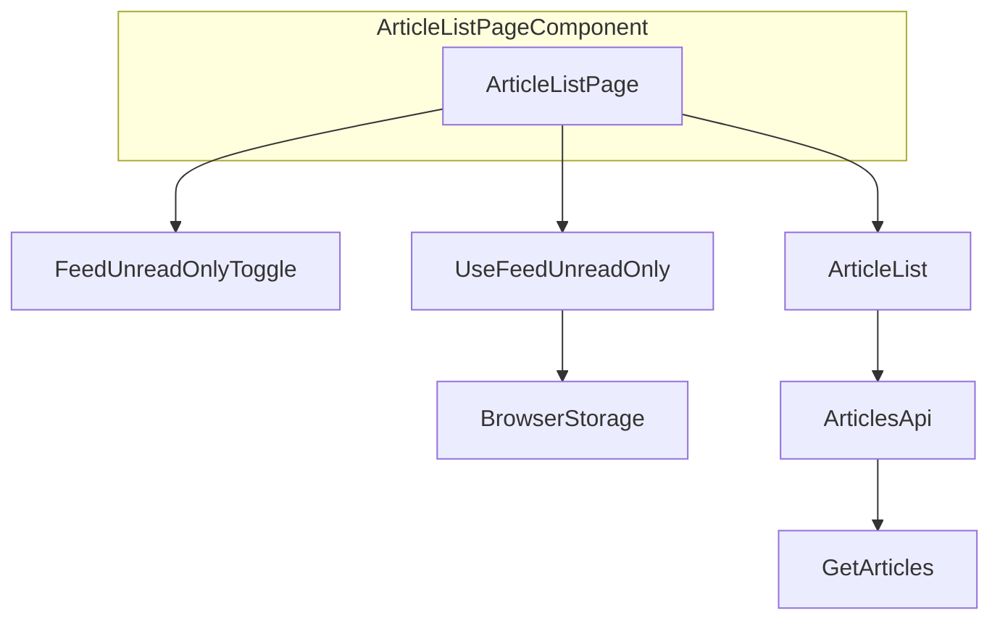
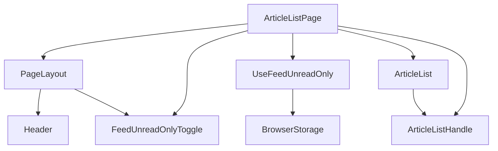
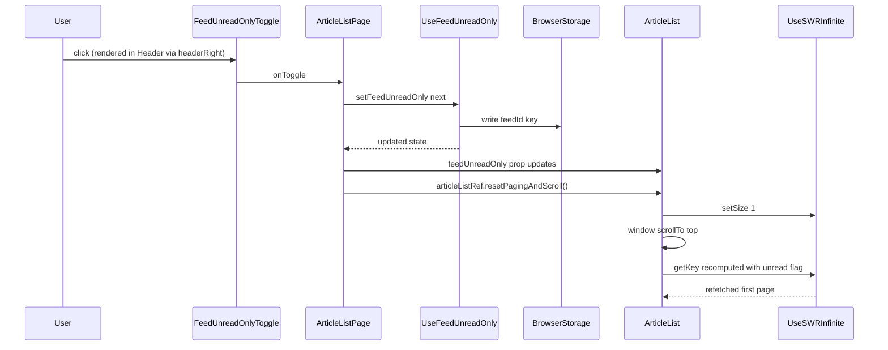

# Technical Design: feed-unread-only-toggle

## Overview

**Purpose**: 個別フィードの記事一覧に「すべて表示」と「未読のみ表示」を切り替えるトグルを追加し、既読記事に紛れた未読記事のタイトルを見落とさず確認できるようにする。

**Users**: 個別フィードの記事一覧を閲覧する利用者。複数のフィードを行き来しながら未読記事だけを確認したい場面で使う。

**Impact**: `ArticleList` の記事一覧に新しい常時表示のトグルを追加する。既存の `unread` 絞り込み(`getArticles` / `GET /api/articles`)をそのまま利用するため、サーバー・DBの変更は無い。表示状態はフィードIDをキーにブラウザのローカルストレージへ保存する。

### Goals

- 個別フィードの記事一覧で「すべて表示」/「未読のみ表示」を切り替えられる
- 切り替えた表示状態をフィードごとに記憶し、同じフィードを再訪したときに復元する
- フィード間を移動しても前のフィードの表示状態を誤って引き継がない
- 切り替え時に一覧の先頭から再読み込みする
- 表示切り替えの操作を見ただけで、現在のモードと切り替え後のモードをひと目で判別できるようにする(要件8)

### Non-Goals

- カテゴリビュー・受信箱・ブックマーク・お気に入り・既読済み一覧への適用
- 既存のカテゴリ向け「未読のみ」設定(`reading.category_unread_only`)の置き換え
- 表示状態のサーバー同期・クロスデバイス同期
- 未読以外の観点(お気に入り・いいね・既読)での絞り込み切り替え

## Boundary Commitments

### This Spec Owns

- 個別フィードページにおける「すべて表示」/「未読のみ表示」の切り替えUIとその文言
- フィードIDをキーにした表示状態のブラウザ内永続化(読み込み・保存・フィード切り替え時の再導出)
- `ArticleList` の `unreadOnly` 判定へのフィード単位の値の合成
- 表示状態切り替え時のページング(`useSWRInfinite` の `size`)リセットとスクロール位置のリセット
- 未読が0件のときの案内表示と、そこから「すべて表示」に戻す導線
- `useFeedUnreadOnly` の呼び出し元をページコンポーネント(`ArticleListPage`)に置くこと(要件7: 表示位置の永続的な可視性への対応)
- ヘッダー(`Header`/`PageLayout`)に汎用の右側アクションスロット(`headerRight`)を新設すること。このスロット自体は本機能が最初に導入する共有の仕組みであり、フィード用トグルはこのスロットに描画される
- `ArticleList` の `unreadOnly` リセット処理(ページング・スクロール)を、外部から呼び出せる命令的メソッド(`resetPagingAndScroll`)として `ArticleListHandle` に切り出すこと
- 汎用の2択トグルスイッチ `UnreadOnlyToggleSwitch`(`src/components/ui/`)の新設。本機能が最初に導入する共有UIプリミティブであり、`FeedUnreadOnlyToggle` はこれを利用して描画する。フォルダ用トグル(`folder-unread-only-toggle`)もこのプリミティブを再利用する(要件8)

### Out of Boundary

- 記事の既読/未読状態そのものを変更する操作(`bulk-mark-read` の責務)
- 未読件数の算出方法、記事の並び順、smart floor を含む一覧の表示範囲の決め方
- `getArticles` / `GET /api/articles` のフィルタAPI自体の変更(既存の `unread` パラメータをそのまま利用)
- カテゴリビューの表示切り替え、および `reading.category_unread_only` 設定の実装
- デモモードのAPIモック実装(`unread` パラメータを既に汎用的に処理しているため変更不要)
- ヘッダー(`Header`/`PageLayout`)自体の一般的なレイアウト・背景・高さ・タイトルの省略表示規則(既存の実装のまま。本機能は右側アクションスロットの追加のみを行う)
- `headerRight` スロットや `resetPagingAndScroll` を、フォルダ用トグル(`folder-unread-only-toggle`)がどう利用するか(呼び出し側であるフォルダ機能の責務)
- `UnreadOnlyToggleSwitch` の配色・アイコン意匠そのものの独自デザイン化。既存の `Button`(`src/components/ui/button.tsx`)と同じテーマトークンのみを使い、新しい配色トークンは追加しない(要件8.4、Issue添付イメージのビジュアルスタイルは採用しない)
- `folder-unread-only-toggle` が `CategoryUnreadOnlyToggle` から `UnreadOnlyToggleSwitch` をどう利用するか(呼び出し側であるフォルダ機能の責務)

### Allowed Dependencies

- クライアント: `src/components/article/article-list.tsx` の既存の `unreadOnly`/`getKey`/`useSWRInfinite` 構成、`src/lib/i18n.ts`、`src/hooks/use-category-unread-only.ts` と同様のローカルストレージ永続化パターン(ただし直接の関数再利用はしない)、`src/hooks/use-scroll-restoration.ts` と同じ `window.scrollTo` によるスクロール制御
- クライアント: `src/components/ui/button.tsx` の `cva` ベースのバリアント定義パターン、および `.claude/rules/frontend.md` が定めるテーマトークン(`bg-accent`/`text-accent-text`/`bg-bg-subtle`/`text-muted` 等)。新しい配色トークンの追加はしない
- クライアント: `src/app.tsx` の `ArticleListPage`(既に `isInbox`/`isBookmarks` 等をルートパスから独自に判定しているページコンポーネント)、`src/components/layout/header.tsx` / `page-layout.tsx`(既存のヘッダー・ページレイアウト)
- サーバー: `GET /api/articles` の既存の `unread` クエリパラメータ(変更なしで利用のみ)
- 共有: なし(新しい型はクライアント内に閉じる)

依存の向き: `src/hooks/use-feed-unread-only.ts` → `src/components/article/feed-unread-only-toggle.tsx` → `src/app.tsx`(`ArticleListPage`)。`ArticleListPage` から `useFeedUnreadOnly` を直接呼び出し、`FeedUnreadOnlyToggle` は表示専用としてコールバックのみを受け取る。`ArticleListPage` は `PageLayout` の `headerRight` にトグル要素を渡し、`ArticleList` には `feedUnreadOnly` の値のみを props で渡す(セッターは渡さない。トグル操作自体は `ArticleListPage` が処理する)。この向きを逆流する import は許容しない。`UnreadOnlyToggleSwitch`(`src/components/ui/`)は `FeedUnreadOnlyToggle` から利用される汎用UIプリミティブであり、フィード固有のロジックを持たない。

### Revalidation Triggers

- `getArticles` の `unread` フィルタの意味・パラメータ名が変わったとき
- `ArticleList` の `feedId`/`categoryId` 変化時のリセット用 `useEffect` パターン(404-410行)が削除・変更されたとき。新フックが依拠する再導出のタイミングが崩れる
- `useSWRInfinite` の `size` リセット規約が変わったとき
- `settings.showFeedActivity` の意味が変わり `FeedMetricsBar` の描画条件が変わったとき。トグルの独立描画の前提が崩れる
- `articles.allRead` / `articles.showReadArticles` の文言がカテゴリ向け専用の意味に変更されたとき。本機能での再利用が不適切になる
- `Header`/`PageLayout` の `headerRight` プロパティの型・描画位置、または `ArticleListHandle.resetPagingAndScroll` のシグネチャ・挙動が変わったとき。`folder-unread-only-toggle` がこれらに依存しているため、変更時は両仕様を確認する
- `ArticleListPage` の `isPlainFeedView` 相当の判定(`Boolean(feedId)`)が、ルーティング構造の変更(例: `/clips` 等が `:feedId` を持つルートに変わる)によって `ArticleList` 内の `isPlainFeedView` の判定と食い違うようになったとき
- `UnreadOnlyToggleSwitch` の props 契約(`unreadOnly`/`onChange`/ラベル)や見た目の前提が変わったとき。`folder-unread-only-toggle` がこのプリミティブに依存しているため、変更時は両仕様を確認する

## Architecture

### Existing Architecture Analysis

`ArticleList`(`src/components/article/article-list.tsx`)は `useSWRInfinite` で `/api/articles` をページ単位に取得し、`unreadOnly`/`bookmarkedOnly`/`likedOnly`/`readOnly`/`noFloor` をクエリパラメータへ変換する `getKey` 関数を持つ。`unreadOnly` は現在 `isInbox || (categoryUnreadOnly && !showReadArticles)` としてのみ算出され、個別フィード(`feedId` のみが設定された状態)では常に `false` になる。

`ArticleList` は既に `[feedId, categoryId]` の変化を検知する `useEffect`(404-410行)を持ち、`showReadArticles`・`noFloor`・`locallyReadIds`・キーボードフォーカスをフィード/カテゴリ切り替え時にリセットしている。ルート(`/feeds/:feedId`)に `key` propが無いため、フィード間の移動では `ArticleList` は再マウントされず、このリセット用 `useEffect` がフィード単位の状態を安全に切り替える唯一の手段になっている。本機能はこのパターンを踏襲する。

`FeedMetricsBar` は `currentFeed.type !== 'clip' && settings.showFeedActivity === 'on'` のときのみ描画される(466-468行)。トグルはこの条件はもちろん `ArticleList` 自体の描画位置からも独立させ、ヘッダー(要件7、次項参照)に描画する。

### Architecture Pattern & Boundary Map



**Architecture Integration**:
- 選択パターン: 既存の「フィード/カテゴリ変化時にローカル状態を再導出する `useEffect`」パターンを、新規フック `useFeedUnreadOnly` として切り出し、独立コンポーネント `FeedUnreadOnlyToggle` から利用する。呼び出し元はページコンポーネント `ArticleListPage`(要件7対応、次項参照)
- ドメイン境界: 永続化とフィード単位の値の再導出は `useFeedUnreadOnly` が所有し、表示とクリックイベントは `FeedUnreadOnlyToggle` が所有する。`ArticleListPage` は両者を配線し、`headerRight` 経由でヘッダーに描画するとともに、`ArticleList` へ `feedUnreadOnly` の値を渡して既存の `unreadOnly`/`getKey`/`size` と接続する
- 既存パターンの維持: `unreadOnly` の算出、`getKey` によるクエリパラメータ生成、`useSWRInfinite` の利用方法は変更しない
- 新規コンポーネントの理由: `FeedMetricsBar` に内包すると `settings.showFeedActivity` の設定次第でトグルごと消えるため、独立させる必要がある(`research.md` 参照)

### Header Actions Slot(要件7)

トグルはスクロールしても隠れないよう、記事一覧本文ではなく常時表示のヘッダー行に描画する。ヘッダーはページコンポーネント(`ArticleListPage`)配下で `PageLayout` → `Header` の順に描画されており、`ArticleList` とは兄弟関係にある(共通の親は `ArticleListPage`)。このため、トグルの状態管理とクリックハンドラは `ArticleListPage` に置き、`ArticleList` へは値のみを props で渡す。

検討した代替案(`research.md` 参照):
- CSS `position: fixed` でヘッダー右上に重ねる案 → 独自の z-index 値が必要になり `.claude/rules/frontend.md` の z-index スケールと整合しないため却下
- `document.body` 以外へのポータル(`createPortal`)で `Header` 内のDOM要素に直接描画する案 → `.claude/rules/frontend.md` が「ポータルは常に `<body>` を対象にする」と定めているため却下
- 採用: 状態とクリックハンドラを共通の親(`ArticleListPage`)へ引き上げ、`PageLayout`/`Header` に新設する `headerRight` prop へ通常のReact子要素として渡す



**Key decisions**:
- `ArticleListPage` が `useFeedUnreadOnly` を呼び出し、`feedUnreadOnly` を `ArticleList` へ props として渡す(セッターは渡さない)
- `ArticleListPage` のトグルクリックハンドラは、状態を反転させたのち `articleListRef.current?.resetPagingAndScroll()` を呼び出す。`resetPagingAndScroll`(`setSize(1)` + `window.scrollTo(0, 0)`)は `ArticleList` が `ArticleListHandle`(既存の `revalidate` と同じ命令的ハンドルの仕組み)経由で公開する新しいメソッドで、フィード用・フォルダ用の両トグルから共通で呼び出される
- `Header`/`PageLayout` に新設する `headerRight?: ReactNode` は汎用スロットであり、トグル固有のロジックを持たない。フィード/フォルダページ以外(受信箱・ブックマーク等)では `undefined` のままとなり、既存の余白(`w-8` スペーサー)と同じ見た目を保つ
- ヘッダー右側スロットの画面上の幅・位置はフィード名/フォルダ名の文字数に依存しない(要件7.3)。タイトルは引き続き中央寄せの `flex-1` 領域に表示され、スロットの幅が変わってもタイトル文字列自体の長さには影響されない

### Unread-Only Toggle Switch(要件8)

現在の実装(`text-accent text-sm hover:underline` のテキストリンク)は、クリックしたときの遷移先を表す文言(例: `unreadOnly=true` のとき「すべて表示」)をラベルとして表示するため、今どちらのモードなのかをラベルの文言からしか判別できない。要件8はこれを解消するため、「すべて表示」「未読のみ表示」の両方の選択肢を常に視認できる2択スイッチに置き換える。

検討した代替案(`research.md` 参照):
- 単一ボタンのまま、アイコンやラベルの太字化だけで現在状態を示す案 → クリック前後で「次にどちらになるか」を利用者が読み取る必要が残り、要件8.1(両方の選択肢を常時視認できる)を満たさないため却下
- フィード用・フォルダ用それぞれに個別のスイッチ実装を持つ案 → 見た目・挙動が完全に同一であり、実装の重複と将来の見た目の乖離リスクを避けるため却下
- 採用: 汎用の2択スイッチ `UnreadOnlyToggleSwitch` を `src/components/ui/` に新設し、`FeedUnreadOnlyToggle`/`CategoryUnreadOnlyToggle` の双方がこれを利用する

**Key decisions**:
- `UnreadOnlyToggleSwitch` は「すべて表示」「未読のみ表示」の2つのセグメントを常に両方描画し、現在選択されている側のセグメントを既存の `Button` の `default` バリアントと同じテーマトークン(`bg-accent`/`text-accent-text`)で強調する。選択されていない側は `text-muted` とする(要件8.1, 8.2, 8.4)
- セグメントのクリックは、クリックされたセグメントの値が現在の状態と異なる場合にのみ `onChange` を呼ぶ。既に選択中のセグメントをクリックしても状態は変化しない
- `FeedUnreadOnlyToggle`/`CategoryUnreadOnlyToggle` の外部向けprops(`{ unreadOnly: boolean; onToggle: () => void }`)は変更しない。`onToggle` は内部で `UnreadOnlyToggleSwitch` の `onChange` から、現在と反対の状態が選択されたときにのみ呼び出される。これにより `ArticleListPage` 側の配線(要件7で確立済み)は変更不要になる
- 色・形状・文字サイズは既存の `Button`/`IconButton` と同じテーマトークンのみを使う。新しい配色トークンの追加や、Issue添付イメージの配色・形状の再現は行わない(要件8.4)

### Technology Stack

| Layer | Choice / Version | Role in Feature | Notes |
|-------|------------------|-----------------|-------|
| Frontend | React 18(既存) + SWR(既存 `swr`/`swr/infinite`) | トグルUIの描画と記事一覧の再取得 | 新規ライブラリ追加なし |
| クライアント永続化 | ブラウザ `localStorage`(既存パターンを踏襲、新規フック) | フィードIDごとの表示状態の保存・復元 | サーバー同期なし |
| i18n | `src/lib/i18n.ts`(既存辞書、`ja`/`en`/`zh`) | トグル文言・空状態文言の提供 | 既存の3言語構成に合わせる |

## File Structure Plan

### Directory Structure
```
src/
├── hooks/
│   ├── use-feed-unread-only.ts        # New: per-feed unread-only state, localStorage-backed
│   └── use-feed-unread-only.test.ts   # New: hook unit tests
├── components/
│   ├── ui/
│   │   ├── unread-only-toggle-switch.tsx       # New (要件8): shared 2-option toggle switch primitive
│   │   └── unread-only-toggle-switch.test.tsx  # New (要件8): component tests
│   ├── article/
│   │   ├── feed-unread-only-toggle.tsx       # Modified (要件8): compose UnreadOnlyToggleSwitch instead of a text link
│   │   ├── feed-unread-only-toggle.test.tsx  # Modified (要件8): assert both segments render and active-segment highlighting
│   │   ├── article-list.tsx                  # Modified: unreadOnly composition from props, pagination/scroll reset exposed via ref
│   │   └── article-list.test.tsx             # Modified: add coverage for the new behavior
│   └── layout/
│       ├── header.tsx                 # Modified: add `headerRight` slot (list mode)
│       ├── header.test.tsx            # Modified: add coverage for `headerRight` rendering
│       ├── page-layout.tsx            # Modified: thread `headerRight` prop through to Header
│       └── page-layout.test.tsx       # Modified: add coverage for `headerRight` passthrough
├── app.tsx                            # Modified: ArticleListPage owns useFeedUnreadOnly, wires toggle into headerRight
└── lib/
    └── i18n.ts                        # Modified: add 2 new dictionary entries (ja/en/zh)
docs/
└── spec/
    ├── 87_feature_feed_unread_only.md # New: feature doc (English, per docs.md rule)
    └── 01_overview.md                 # Modified: register the new doc in the index
README.md                              # Modified: add a one-line feature bullet
```

### Modified Files
- `src/app.tsx`(`ArticleListPage`) — `feedId` から `isPlainFeedView`(`Boolean(feedId)`。ルーティング上 `/feeds/:feedId` 以外は `feedId` を持たないため `ArticleList` 内の判定と等価)を導出し、`useFeedUnreadOnly` を呼び出す。`isPlainFeedView` のとき `FeedUnreadOnlyToggle` を生成し、`PageLayout` の `headerRight` prop に渡す。トグルのクリックハンドラで状態を反転させ、`articleListRef.current?.resetPagingAndScroll()` を呼ぶ。`ArticleList` へは `feedUnreadOnly` の値と、空状態導線用の `onFeedUnreadOnlyChange` コールバックを props で渡す。
- `src/components/article/article-list.tsx` — `useFeedUnreadOnly` の直接呼び出しをやめ、`feedUnreadOnly`/`onFeedUnreadOnlyChange` を props として受け取る。`unreadOnly` への合成ロジック(`isPlainFeedView && feedUnreadOnly === 'on'`)は維持する。`FeedUnreadOnlyToggle` 自体の描画はここでは行わない(ヘッダー側に移動)。既存の `allReadEmpty` 判定・案内表示は維持し、ボタンのハンドラは `onFeedUnreadOnlyChange('off')` を呼んだのち `setSize(1)` する。`ArticleListHandle` に `resetPagingAndScroll: () => void`(`setSize(1)` + `window.scrollTo(0, 0)`)を追加する。
- `src/components/layout/header.tsx` — list モードの右側スペーサー(`<span className="w-8" />`)を `headerRight?: ReactNode` を描画する汎用スロットに置き換える。`headerRight` が無いときは既存と同じ見た目(空のスペーサー)を保つ。
- `src/components/layout/page-layout.tsx` — `PageLayoutProps` に `headerRight?: ReactNode` を追加し、list モードの `Header` にそのまま渡す。detail モードには渡さない(要件7の対象は一覧ページのみ)。
- `src/lib/i18n.ts` — `feed.unreadOnlyToggle.showUnreadOnly` / `feed.unreadOnlyToggle.showAll` の2キーを `ja`/`en`/`zh` で追加する。
- `src/components/article/feed-unread-only-toggle.tsx`(要件8) — 内部の描画をテキストリンクから `UnreadOnlyToggleSwitch` の利用に置き換える。外部向けprops(`{ unreadOnly, onToggle }`)は変更しない。既存の `feed.unreadOnlyToggle.showAll`/`showUnreadOnly` キーを、各セグメントの `aria-label` としてそのまま再利用する(新規i18nキーの追加は不要)。
- `docs/spec/01_overview.md` — 新規ドキュメントへのリンクを追加する。
- `README.md` — 機能一覧に1行追加する(`docs.md` ルールに従い、ユーザー向け機能の変更として反映)。

## System Flows

トグル切り替え時の状態更新とページング・スクロールのリセットは複数ステップにまたがるため、シーケンス図で明示する。



**Key decisions**: `setSize(1)` は `useSWRInfinite` がフェッチキーの変更だけでは自動的にページング数を戻さないための明示的なリセットであり(`research.md` 参照)、これを怠ると切り替え前に読み込んでいたページ数分を新しい絞り込み条件で再取得してしまう。

## Requirements Traceability

| Requirement | Summary | Components | Interfaces | Flows |
|-------------|---------|------------|------------|-------|
| 1.1 | 個別フィードページでトグルを提供する | ArticleList, FeedUnreadOnlyToggle | — | — |
| 1.2 | 受信箱・カテゴリ・コレクション表示ではトグルを出さない | ArticleList | `isPlainFeedView` 算出 | — |
| 1.3 | 未読のみ表示で既読記事を除外する | ArticleList | `unreadOnly` 合成、`getKey` | トグル切り替えシーケンス |
| 1.4 | すべて表示で既読・未読を表示する | ArticleList | `unreadOnly` 合成 | トグル切り替えシーケンス |
| 1.5 | 現在の表示状態を判別できるようにする | FeedUnreadOnlyToggle | Props `unreadOnly` | — |
| 2.1 | 未読が無い場合の案内表示 | ArticleList | `feedAllReadEmpty` 算出 | — |
| 2.2 | 案内表示から「すべて表示」に戻せる | ArticleList | 既存 `articles.showReadArticles` ボタンの再利用 | — |
| 3.1-3.3 | フィードごとに表示状態を記憶・復元・初期値 | UseFeedUnreadOnly | `useFeedUnreadOnly(feedId)` | — |
| 3.4 | 同じ端末の同じブラウザでのみ復元 | UseFeedUnreadOnly | `localStorage` 利用(サーバー同期なし) | — |
| 4.1-4.2 | フィード間切り替えでの状態の非引き継ぎ | UseFeedUnreadOnly | `feedId` 変化時の再導出 `useEffect` | トグル切り替えシーケンス |
| 5.1-5.2 | 切り替え時の先頭からの再読み込み | ArticleListPage, ArticleList | `ArticleListHandle.resetPagingAndScroll` | トグル切り替えシーケンス |
| 6.1 | 文言の多言語提供 | i18n dictionary | `feed.unreadOnlyToggle.*`、既存 `articles.allRead`/`articles.showReadArticles` | — |
| 7.1 | スクロール中もトグルを表示し続ける | Header, PageLayout | `headerRight` prop | — |
| 7.2 | フィード名と同じ常時表示領域に配置する | Header, PageLayout, ArticleListPage | `headerRight` prop | トグル切り替えシーケンス |
| 7.3 | フィード名の文字数でトグルの位置が変わらない | Header | 右側スロットの固定配置(`headerRight` はタイトルの `flex-1` 領域と独立) | — |
| 8.1 | 両方の選択肢を常に視認できる形で示す | UnreadOnlyToggleSwitch | 2セグメントの常時描画 | — |
| 8.2 | 現在選択されている側を区別できるように強調する | UnreadOnlyToggleSwitch | アクティブセグメントのテーマトークン強調(`bg-accent`/`text-accent-text`) | — |
| 8.3 | 切り替え直後に選択状態を即座に反映する | UnreadOnlyToggleSwitch, FeedUnreadOnlyToggle | `onChange` → `onToggle` の同期呼び出し | トグル切り替えシーケンス |
| 8.4 | 配色・形状・文字サイズを既存デザインと一貫させる | UnreadOnlyToggleSwitch | 既存 `Button` と同じテーマトークンの利用、新規トークン追加なし | — |

## Components and Interfaces

| Component | Domain/Layer | Intent | Req Coverage | Key Dependencies (P0/P1) | Contracts |
|-----------|--------------|--------|---------------|---------------------------|-----------|
| useFeedUnreadOnly | Client State | フィードIDごとの表示状態を保持・永続化する | 3.1-3.4, 4.1-4.2 | BrowserStorage (P0) | State |
| UnreadOnlyToggleSwitch | UI | 「すべて表示」/「未読のみ表示」を常に両方視認できる形で示す汎用2択スイッチ | 8.1-8.4 | テーマトークン(既存 Button と共通)(P1) | State |
| FeedUnreadOnlyToggle | UI | トグルの表示とクリックイベントの通知(`UnreadOnlyToggleSwitch` を利用) | 1.1, 1.5, 6.1, 8.1-8.4 | useFeedUnreadOnly の戻り値 (P0), UnreadOnlyToggleSwitch (P0) | State |
| ArticleListPage(変更箇所) | UI / Integration | `useFeedUnreadOnly` の呼び出し、`FeedUnreadOnlyToggle` の生成、`headerRight` への配線、トグル操作時の `resetPagingAndScroll` 呼び出し | 1.1, 1.5, 5.1-5.2, 7.1-7.3 | useFeedUnreadOnly (P0), FeedUnreadOnlyToggle (P0), PageLayout (P0), ArticleListHandle (P0) | State |
| Header / PageLayout(変更箇所) | UI | ヘッダー右側に汎用アクションスロット(`headerRight`)を提供する | 7.1-7.3 | — | State |
| ArticleList(変更箇所) | UI / Integration | 個別フィード判定、`unreadOnly` 合成、`resetPagingAndScroll` の公開、空状態の拡張 | 1.1-1.4, 1.2, 2.1-2.2, 5.1-5.2 | FeedUnreadOnlyState prop (P0), useSWRInfinite (P0) | State |

### Client State

#### useFeedUnreadOnly

| Field | Detail |
|-------|--------|
| Intent | フィードIDをキーに「すべて表示/未読のみ表示」の状態を保持し、`localStorage` に永続化する |
| Requirements | 3.1, 3.2, 3.3, 3.4, 4.1, 4.2 |

**Responsibilities & Constraints**
- 状態は `feedId` ごとに独立し、`feedId` が変化したら対応する保存値(無ければ初期値)へ再導出する
- `createLocalStorageHook`(`src/hooks/create-local-storage-hook.ts`)は再利用しない。そのファクトリはキーをクロージャで固定し、`useState` の遅延初期化がマウント時に1度しか走らないため、`feedId` ごとの動的キーには転用できない(`research.md` 参照)
- `feedId` が `undefined` のとき(個別フィードページ以外)は常に `'off'` を返し、書き込みも行わない

**Dependencies**
- Outbound: `window.localStorage` — 永続化 (P0)

**Contracts**: Service [x] / API [ ] / Event [ ] / Batch [ ] / State [x]

##### Service Interface
```typescript
export type FeedUnreadOnlyState = 'on' | 'off'

export function useFeedUnreadOnly(
  feedId: number | undefined,
): [FeedUnreadOnlyState, (next: FeedUnreadOnlyState) => void]
```
- Preconditions: `feedId` is `undefined` when the current route is not an individual feed page.
- Postconditions: The returned state reflects the value stored under this `feedId` (or `'off'` when nothing is stored or `feedId` is `undefined`). Calling the setter persists the new value under a `feedId`-scoped key and the returned state updates on the next render.
- Invariants: The state is re-derived from storage whenever `feedId` changes; no value from one `feedId` is ever returned for a different `feedId`.

##### State Management
- State model: `useState<FeedUnreadOnlyState>` initialized lazily from storage for the current `feedId`, mirrored to storage on every setter call
- Persistence & consistency: `localStorage` key pattern `feed-unread-only:{feedId}`, value `'on'` or `'off'`; unrecognized stored values fall back to `'off'`(既存の `createLocalStorageHook` と同じバリデーション方針)
- Concurrency strategy: 単一タブ内のReact状態のみを信頼源とする。他タブでの変更検知(`storage` イベント購読)は行わない(既存の `use-category-unread-only.ts` も同様に行っていない)

**Implementation Notes**
- Integration: `ArticleListPage` から `feedId`(個別フィードページのときのみ、それ以外は `undefined`)を渡して利用する
- Validation: 不正な保存値は初期値 `'off'` として扱う
- Risks: `localStorage` が利用不可(プライベートモード等)の場合の挙動は既存の `createLocalStorageHook` と同じ(例外の握りつぶしは行わない)。この挙動はアプリ全体で統一されており、本機能だけの特別対応はしない

### UI

#### UnreadOnlyToggleSwitch(要件8、新設)

| Field | Detail |
|-------|--------|
| Intent | 「すべて表示」/「未読のみ表示」の2つの選択肢を常に両方視認できる形で示し、現在選択されている側を区別できるように強調する汎用UIプリミティブ。フィード固有・フォルダ固有のロジックを持たない |
| Requirements | 8.1, 8.2, 8.3, 8.4 |

**Responsibilities & Constraints**
- 表示専用。状態の保持・永続化ロジックを持たない
- 2つのセグメント(「すべて表示」/「未読のみ表示」)を常に両方描画する(要件8.1)。現在選択されている側は既存の `Button` の `default` バリアントと同じテーマトークン(`bg-accent`/`text-accent-text`)で強調し、選択されていない側は `text-muted` とする(要件8.2, 8.4)
- クリックされたセグメントの値が現在の `unreadOnly` と異なるときにのみ `onChange` を呼ぶ。既に選択中のセグメントをクリックしても `onChange` は呼ばれない
- ラベルはこのコンポーネント自身では持たず、呼び出し元から渡されるアクセシブルラベル文字列をそのまま各セグメントの `aria-label` に設定する(多言語対応は呼び出し元のi18n辞書に委譲する)

```typescript
interface UnreadOnlyToggleSwitchProps {
  unreadOnly: boolean
  onChange: (unreadOnly: boolean) => void
  /** aria-label for the "show all" segment */
  showAllLabel: string
  /** aria-label for the "unread only" segment */
  unreadOnlyLabel: string
}
```

**Implementation Notes**
- Integration: `FeedUnreadOnlyToggle`(本機能)と `CategoryUnreadOnlyToggle`(`folder-unread-only-toggle`)の双方から利用される
- Validation: 該当なし(表示専用)
- Risks: 該当なし

#### FeedUnreadOnlyToggle

| Field | Detail |
|-------|--------|
| Intent | `UnreadOnlyToggleSwitch` にフィード向けのラベルを渡して描画し、選択が変わったときに `onToggle` へ通知する |
| Requirements | 1.1, 1.5, 6.1, 8.1-8.4 |

**Responsibilities & Constraints**
- 表示専用。状態の保持・永続化ロジックを持たない
- `settings.showFeedActivity` の値に関わらず常に描画される(呼び出し元である `ArticleList` がこの条件を課さない)
- 内部で `UnreadOnlyToggleSwitch` を使用する(要件8)。外部向けprops(`{ unreadOnly, onToggle }`)は変更しない。既存の `feed.unreadOnlyToggle.showAll`/`showUnreadOnly` の文言を、`UnreadOnlyToggleSwitch` の `showAllLabel`/`unreadOnlyLabel` としてそのまま渡す

```typescript
interface FeedUnreadOnlyToggleProps {
  unreadOnly: boolean
  onToggle: () => void
}
```

**Implementation Notes**
- Integration: `ArticleListPage` が個別フィードページ判定(`isPlainFeedView`)のときのみ生成し、`PageLayout` の `headerRight` に渡す
- Validation: 該当なし(表示専用)
- Risks: 該当なし

### Integration

#### ArticleListPage(変更箇所)

| Field | Detail |
|-------|--------|
| Intent | 個別フィード判定、`useFeedUnreadOnly` と `FeedUnreadOnlyToggle` の配線、`headerRight` への描画、トグル操作時の状態更新と `ArticleList` のページング・スクロールリセットの発火 |
| Requirements | 1.1, 1.5, 5.1, 5.2, 7.1, 7.2, 7.3 |

**Responsibilities & Constraints**
- `isPlainFeedView = Boolean(feedId)` を算出する(ルーティング上 `/feeds/:feedId` 以外のルートは `feedId` を持たないため、`ArticleList` 内の `Boolean(feedIdParam) && !isCollectionView` と等価)
- `isPlainFeedView` のとき `useFeedUnreadOnly(feedId)` を呼び出し、`FeedUnreadOnlyToggle` を生成して `PageLayout` の `headerRight` に渡す。`isPlainFeedView` が false のときは `headerRight` にフィード用トグルを渡さない
- トグルのクリックハンドラは、状態の反転(`setFeedUnreadOnly`)ののち `articleListRef.current?.resetPagingAndScroll()` を呼ぶ
- `ArticleList` へは `feedUnreadOnly` の値と `onFeedUnreadOnlyChange`(空状態導線用)を props として渡す

**Dependencies**
- Inbound: なし(ルートに直接マッピングされるページコンポーネント)
- Outbound: `useFeedUnreadOnly` (P0), `FeedUnreadOnlyToggle` (P0), `PageLayout` の `headerRight` (P0), `ArticleListHandle.resetPagingAndScroll` (P0)

**Contracts**: Service [ ] / API [ ] / Event [ ] / Batch [ ] / State [x]

##### State Management
- State model: `feedUnreadOnly`(`useFeedUnreadOnly` の戻り値)をページコンポーネントの状態として保持する
- Persistence & consistency: 永続化は `useFeedUnreadOnly` に委譲する
- Concurrency strategy: 該当なし(単一コンポーネント内の同期的な状態更新)

**Implementation Notes**
- Integration: `folder-unread-only-toggle` も同じ `ArticleListPage` にフォルダ用の配線を追加する(それぞれ `isPlainFeedView`/`categoryId !== undefined` で排他的に分岐するため、同時に両方の `headerRight` 内容が競合することはない)
- Validation: 該当なし
- Risks: `isPlainFeedView` の算出方法が `ArticleList` 内の算出と重複するため、ルーティング構造が変わった場合は両方を同時に更新する必要がある(Revalidation Triggers 参照)

#### ArticleList(変更箇所)

| Field | Detail |
|-------|--------|
| Intent | 個別フィード判定、`unreadOnly` への合成、`resetPagingAndScroll` の公開、空状態表示の拡張 |
| Requirements | 1.2, 1.3, 1.4, 2.1, 2.2, 5.1, 5.2 |

**Responsibilities & Constraints**
- `isPlainFeedView = Boolean(feedIdParam) && !isCollectionView` を算出する(トグルの描画自体は行わないが、`unreadOnly` の合成と空状態判定に使う)
- `feedUnreadOnly`(props)を受け取り、`unreadOnly` の算出を `isInbox || (categoryUnreadOnly && !showReadArticles) || (isPlainFeedView && feedUnreadOnly === 'on')` に拡張する
- `ArticleListHandle` に `resetPagingAndScroll: () => void`(`setSize(1)` + `window.scrollTo(0, 0)`)を追加し、`revalidate` と同様に `useImperativeHandle` 経由で公開する。フィード用・フォルダ用の両トグルのクリックハンドラから共通で呼び出される
- 既存の `allReadEmpty`(カテゴリ向け)と並存する形で `feedAllReadEmpty = isEmpty && isPlainFeedView && feedUnreadOnly === 'on' && totalAll != null && totalAll > 0` を算出し、空状態のレンダリング条件を `allReadEmpty || feedAllReadEmpty` に拡張する。案内のボタンは `feedAllReadEmpty` のときは `onFeedUnreadOnlyChange('off')` を呼んだのち `setSize(1)` する

**Dependencies**
- Inbound: `ArticleListPage`(`feedUnreadOnly`/`onFeedUnreadOnlyChange` props、`ref` 経由の `resetPagingAndScroll` 呼び出し)
- Outbound: `useSWRInfinite` の `setSize` (P0)

**Contracts**: Service [ ] / API [ ] / Event [ ] / Batch [ ] / State [x]

##### State Management
- State model: `feedUnreadOnly` は props 由来の値として扱う(このコンポーネントは所有しない)。既存の `noFloor` 等のローカル状態は変更しない
- Persistence & consistency: 永続化は `useFeedUnreadOnly`(呼び出し元は `ArticleListPage`)に委譲する
- Concurrency strategy: 既存の `useSWRInfinite` の再検証・重複リクエスト制御をそのまま利用する

**Implementation Notes**
- Integration: トグル自体の描画は行わない(ヘッダー側で `ArticleListPage` が描画する)
- Validation: 該当なし
- Risks: 空状態の分岐が増えるため、`allReadEmpty` と `feedAllReadEmpty` が同時にtrueになるケースが無いことを実装時に確認する(`categoryUnreadOnly` が有効な状態で個別フィードページに遷移することは現在のルーティング上あり得ないため、相互排他になる見込み)

### UI(共有インフラ)

#### Header / PageLayout(変更箇所)

| Field | Detail |
|-------|--------|
| Intent | ヘッダー右側に、フィード名/フォルダ名の文字数に依存しない固定領域(`headerRight`)を提供する |
| Requirements | 7.1, 7.2, 7.3 |

**Responsibilities & Constraints**
- `PageLayoutProps`/`HeaderProps` に `headerRight?: ReactNode` を追加する(list モードのみ。detail モードは対象外)
- `Header` の list モードは、右側の `<span className="w-8" />` を `headerRight` を描画するスロットに置き換える。`headerRight` が `undefined` のときは既存と同じ見た目(空のスペーサー)を保つ
- このコンポーネント自体はトグル固有のロジックを持たない汎用スロットであり、`ArticleListPage` が渡す内容に関与しない

```typescript
interface HeaderProps {
  // ...既存のprops
  headerRight?: ReactNode
}
```

**Implementation Notes**
- Integration: `feed-unread-only-toggle` がこのスロットを新設し、`folder-unread-only-toggle` が同じスロットを再利用する(Allowed Dependencies 参照)
- Validation: 該当なし(表示専用)
- Risks: スロットの内容(トグルのラベル文字列)によって右側領域の幅が変わり得るため、タイトルの中央寄せが厳密なピクセル対称にならない場合がある。これはタイトル文字列の長さには依存しないため要件7.3の対象外の許容範囲とする

## Data Models

### Logical Data Model

サーバー側のデータモデルに変更は無い。クライアント側の永続化のみ、以下の形で `localStorage` に保持する。

| Key pattern | Value | Scope |
|---|---|---|
| `feed-unread-only:{feedId}` | `'on'` \| `'off'` | ブラウザ単位、フィードID単位 |

`feedId` が存在しないキーは未保存として扱い、初期値 `'off'` にフォールバックする。サーバー・DBとの同期は行わない(Non-Goals参照)。

## Error Handling

### Error Strategy
本機能はクライアントローカルの状態切り替えのみで、サーバーへの書き込みを伴わないため、業務エラーは発生しない。既存の `createLocalStorageHook` と同様、`localStorage` へのアクセス失敗(プライベートモード等)に対する特別なフォールバック処理はアプリ全体の既存方針に合わせて追加しない。

### Error Categories and Responses
- 該当なし(新規のAPI呼び出し・サーバーエラーを伴わない)

## Testing Strategy

### Unit Tests
- `useFeedUnreadOnly`: `feedId` に対応する保存値が無いとき `'off'` を返す
- `useFeedUnreadOnly`: 保存済みの値(`'on'`)を `feedId` に対して正しく返す
- `useFeedUnreadOnly`: `feedId` が変化したとき、直前の `feedId` の値を引き継がず、新しい `feedId` に対応する値(無ければ `'off'`)へ再導出する(feasibility検証で発見したフィード遷移時の状態残留バグの再発防止テスト)
- `useFeedUnreadOnly`: セッターの呼び出しで `feedId` に対応するキーへ保存される
- `useFeedUnreadOnly`: `feedId` が `undefined` のとき、常に `'off'` を返し保存も行わない

### Component Tests
- `UnreadOnlyToggleSwitch`: `unreadOnly` の値に関わらず、「すべて表示」「未読のみ表示」の両方のセグメントが常に描画される(要件8.1)
- `UnreadOnlyToggleSwitch`: `unreadOnly=false` のとき「すべて表示」セグメントが強調表示(アクティブ)される(要件8.2)
- `UnreadOnlyToggleSwitch`: `unreadOnly=true` のとき「未読のみ表示」セグメントが強調表示(アクティブ)される(要件8.2)
- `UnreadOnlyToggleSwitch`: 現在選択されていない側のセグメントをクリックすると `onChange` が反対の値で呼ばれる(要件8.3)
- `UnreadOnlyToggleSwitch`: 現在選択されている側のセグメントをクリックしても `onChange` は呼ばれない
- `FeedUnreadOnlyToggle`: `unreadOnly=false`/`true` のいずれでも、両方のセグメントの `aria-label` が既存の `feed.unreadOnlyToggle.*` 文言で描画される(要件6.1, 8.1)
- `FeedUnreadOnlyToggle`: 現在の状態と異なるセグメントをクリックすると `onToggle` が呼ばれる。現在の状態と同じセグメントをクリックしても `onToggle` は呼ばれない(旧: 常に `onToggle` が呼ばれる、というテキストリンク時代の前提を置き換える回帰防止テスト)

### Integration Tests(`article-list.test.tsx`)
- `feedUnreadOnly` prop が `'on'` のとき `getKey` が生成するリクエストに `unread=1` が含まれる
- `ArticleListHandle.resetPagingAndScroll()` の呼び出しで `setSize(1)` と `window.scrollTo(0, 0)` が実行される
- 未読のみ表示で対象フィードの未読が0件のとき、案内表示(既存の `articles.allRead`/`articles.showReadArticles` 文言)が出て、クリックで `onFeedUnreadOnlyChange('off')` が呼ばれる
- `ArticleList` はトグル自体を描画しない(ヘッダー側の責務であることの回帰防止)

### Integration Tests(`app.test.tsx` などページレベル)
- 個別フィードページ(`feedId` あり、コレクションビューでない)でのみ `FeedUnreadOnlyToggle` が `headerRight` 経由で描画される
- 受信箱・カテゴリ別・ブックマーク・お気に入り・既読済み・クリップの各ビューではフィード用トグルが描画されない
- トグルをクリックすると `feedUnreadOnly` が反転し、`ArticleListHandle.resetPagingAndScroll` が呼ばれる
- 別フィードへ遷移したとき、遷移先フィードの記憶済み表示状態(または初期状態)が反映され、遷移元の状態を引き継がない

### Component Tests(`header.test.tsx` / `page-layout.test.tsx`)
- `headerRight` が指定されたとき、list モードのヘッダー右側にその内容が描画される
- `headerRight` が未指定のとき、既存と同じ見た目(空のスペーサー)になる(他ビューでの回帰防止)
- `headerRight` の内容の有無やタイトル文字列の長さによらず、`headerRight` スロット自体の描画位置が変わらない
