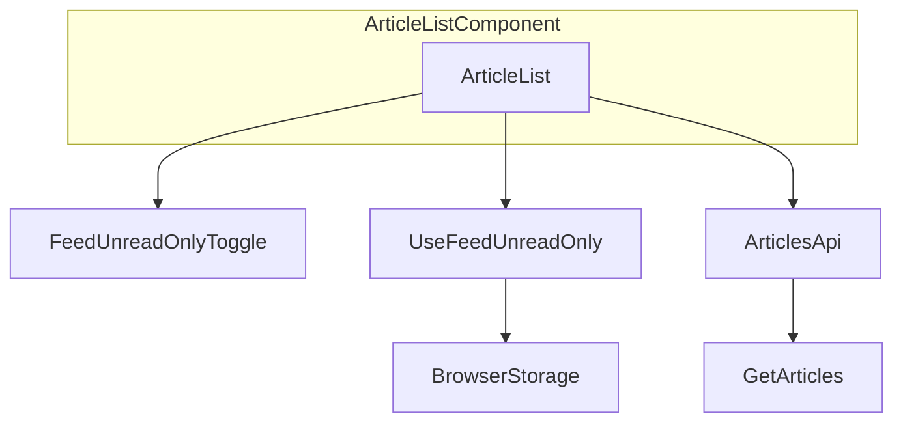
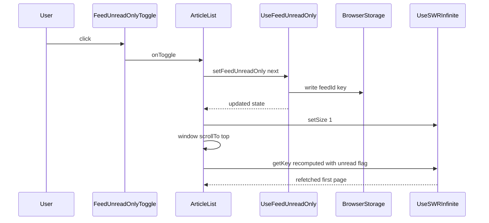

# Technical Design: feed-unread-only-toggle

## Overview

**Purpose**: 個別フィードの記事一覧に「すべて表示」と「未読のみ表示」を切り替えるトグルを追加し、既読記事に紛れた未読記事のタイトルを見落とさず確認できるようにする。

**Users**: 個別フィードの記事一覧を閲覧する利用者。複数のフィードを行き来しながら未読記事だけを確認したい場面で使う。

**Impact**: `ArticleList` の記事一覧に新しい常時表示のトグルを追加する。既存の `unread` 絞り込み(`getArticles` / `GET /api/articles`)をそのまま利用するため、サーバー・DBの変更は無い。表示状態はフィードIDをキーにブラウザのローカルストレージへ保存する。

### Goals

- 個別フィードの記事一覧で「すべて表示」/「未読のみ表示」を切り替えられる
- 切り替えた表示状態をフィードごとに記憶し、同じフィードを再訪したときに復元する
- フィード間を移動しても前のフィードの表示状態を誤って引き継がない
- 切り替え時に一覧の先頭から再読み込みする

### Non-Goals

- カテゴリビュー・受信箱・ブックマーク・お気に入り・既読済み一覧への適用
- 既存のカテゴリ向け「未読のみ」設定(`reading.category_unread_only`)の置き換え
- 表示状態のサーバー同期・クロスデバイス同期
- 未読以外の観点(お気に入り・いいね・既読)での絞り込み切り替え

## Boundary Commitments

### This Spec Owns

- 個別フィードページにおける「すべて表示」/「未読のみ表示」の切り替えUIとその文言
- フィードIDをキーにした表示状態のブラウザ内永続化(読み込み・保存・フィード切り替え時の再導出)
- `ArticleList` の `unreadOnly` 判定へのフィード単位の値の合成
- 表示状態切り替え時のページング(`useSWRInfinite` の `size`)リセットとスクロール位置のリセット
- 未読が0件のときの案内表示と、そこから「すべて表示」に戻す導線

### Out of Boundary

- 記事の既読/未読状態そのものを変更する操作(`bulk-mark-read` の責務)
- 未読件数の算出方法、記事の並び順、smart floor を含む一覧の表示範囲の決め方
- `getArticles` / `GET /api/articles` のフィルタAPI自体の変更(既存の `unread` パラメータをそのまま利用)
- カテゴリビューの表示切り替え、および `reading.category_unread_only` 設定の実装
- デモモードのAPIモック実装(`unread` パラメータを既に汎用的に処理しているため変更不要)

### Allowed Dependencies

- クライアント: `src/components/article/article-list.tsx` の既存の `unreadOnly`/`getKey`/`useSWRInfinite` 構成、`src/lib/i18n.ts`、`src/hooks/use-category-unread-only.ts` と同様のローカルストレージ永続化パターン(ただし直接の関数再利用はしない)、`src/hooks/use-scroll-restoration.ts` と同じ `window.scrollTo` によるスクロール制御
- サーバー: `GET /api/articles` の既存の `unread` クエリパラメータ(変更なしで利用のみ)
- 共有: なし(新しい型はクライアント内に閉じる)

依存の向き: `src/hooks/use-feed-unread-only.ts` → `src/components/article/feed-unread-only-toggle.tsx` → `src/components/article/article-list.tsx`。`ArticleList` から `useFeedUnreadOnly` を直接呼び出し、`FeedUnreadOnlyToggle` は表示専用としてコールバックのみを受け取る。この向きを逆流する import は許容しない。

### Revalidation Triggers

- `getArticles` の `unread` フィルタの意味・パラメータ名が変わったとき
- `ArticleList` の `feedId`/`categoryId` 変化時のリセット用 `useEffect` パターン(404-410行)が削除・変更されたとき。新フックが依拠する再導出のタイミングが崩れる
- `useSWRInfinite` の `size` リセット規約が変わったとき
- `settings.showFeedActivity` の意味が変わり `FeedMetricsBar` の描画条件が変わったとき。トグルの独立描画の前提が崩れる
- `articles.allRead` / `articles.showReadArticles` の文言がカテゴリ向け専用の意味に変更されたとき。本機能での再利用が不適切になる

## Architecture

### Existing Architecture Analysis

`ArticleList`(`src/components/article/article-list.tsx`)は `useSWRInfinite` で `/api/articles` をページ単位に取得し、`unreadOnly`/`bookmarkedOnly`/`likedOnly`/`readOnly`/`noFloor` をクエリパラメータへ変換する `getKey` 関数を持つ。`unreadOnly` は現在 `isInbox || (categoryUnreadOnly && !showReadArticles)` としてのみ算出され、個別フィード(`feedId` のみが設定された状態)では常に `false` になる。

`ArticleList` は既に `[feedId, categoryId]` の変化を検知する `useEffect`(404-410行)を持ち、`showReadArticles`・`noFloor`・`locallyReadIds`・キーボードフォーカスをフィード/カテゴリ切り替え時にリセットしている。ルート(`/feeds/:feedId`)に `key` propが無いため、フィード間の移動では `ArticleList` は再マウントされず、このリセット用 `useEffect` がフィード単位の状態を安全に切り替える唯一の手段になっている。本機能はこのパターンを踏襲する。

`FeedMetricsBar` は `currentFeed.type !== 'clip' && settings.showFeedActivity === 'on'` のときのみ描画される(466-468行)。新しいトグルはこの条件に影響されないよう、独立した要素として描画する。

### Architecture Pattern & Boundary Map



**Architecture Integration**:
- 選択パターン: 既存の「フィード/カテゴリ変化時にローカル状態を再導出する `useEffect`」パターンを、新規フック `useFeedUnreadOnly` として切り出し、独立コンポーネント `FeedUnreadOnlyToggle` から利用する
- ドメイン境界: 永続化とフィード単位の値の再導出は `useFeedUnreadOnly` が所有し、表示とクリックイベントは `FeedUnreadOnlyToggle` が所有する。`ArticleList` は両者を配線し、既存の `unreadOnly`/`getKey`/`size` と接続する責務のみを持つ
- 既存パターンの維持: `unreadOnly` の算出、`getKey` によるクエリパラメータ生成、`useSWRInfinite` の利用方法は変更しない
- 新規コンポーネントの理由: `FeedMetricsBar` に内包すると `settings.showFeedActivity` の設定次第でトグルごと消えるため、独立させる必要がある(`research.md` 参照)

### Technology Stack

| Layer | Choice / Version | Role in Feature | Notes |
|-------|------------------|-----------------|-------|
| Frontend | React 18(既存) + SWR(既存 `swr`/`swr/infinite`) | トグルUIの描画と記事一覧の再取得 | 新規ライブラリ追加なし |
| クライアント永続化 | ブラウザ `localStorage`(既存パターンを踏襲、新規フック) | フィードIDごとの表示状態の保存・復元 | サーバー同期なし |
| i18n | `src/lib/i18n.ts`(既存辞書、`ja`/`en`/`zh`) | トグル文言・空状態文言の提供 | 既存の3言語構成に合わせる |

## File Structure Plan

### Directory Structure
```
src/
├── hooks/
│   ├── use-feed-unread-only.ts        # New: per-feed unread-only state, localStorage-backed
│   └── use-feed-unread-only.test.ts   # New: hook unit tests
├── components/
│   └── article/
│       ├── feed-unread-only-toggle.tsx       # New: presentational toggle control
│       ├── feed-unread-only-toggle.test.tsx  # New: component tests
│       ├── article-list.tsx                  # Modified: wire toggle, unreadOnly, pagination reset
│       └── article-list.test.tsx             # Modified: add coverage for the new behavior
├── lib/
│   └── i18n.ts                        # Modified: add 2 new dictionary entries (ja/en/zh)
docs/
└── spec/
    ├── 87_feature_feed_unread_only.md # New: feature doc (English, per docs.md rule)
    └── 01_overview.md                 # Modified: register the new doc in the index
README.md                              # Modified: add a one-line feature bullet
```

### Modified Files
- `src/components/article/article-list.tsx` — `feedIdParam`/`isCollectionView` から個別フィード判定(`isPlainFeedView`)を導出し、`useFeedUnreadOnly` を呼び出して `unreadOnly` に合成する。`FeedUnreadOnlyToggle` を `FeedMetricsBar` から独立させて描画する。トグルのハンドラで `setSize(1)` と `window.scrollTo(0, 0)` を呼ぶ。既存の `allReadEmpty` 判定を拡張し、フィード単位の未読0件ケースでも同じ空状態UIを再利用する。
- `src/lib/i18n.ts` — `feed.unreadOnlyToggle.showUnreadOnly` / `feed.unreadOnlyToggle.showAll` の2キーを `ja`/`en`/`zh` で追加する。
- `docs/spec/01_overview.md` — 新規ドキュメントへのリンクを追加する。
- `README.md` — 機能一覧に1行追加する(`docs.md` ルールに従い、ユーザー向け機能の変更として反映)。

## System Flows

トグル切り替え時の状態更新とページング・スクロールのリセットは複数ステップにまたがるため、シーケンス図で明示する。



**Key decisions**: `setSize(1)` は `useSWRInfinite` がフェッチキーの変更だけでは自動的にページング数を戻さないための明示的なリセットであり(`research.md` 参照)、これを怠ると切り替え前に読み込んでいたページ数分を新しい絞り込み条件で再取得してしまう。

## Requirements Traceability

| Requirement | Summary | Components | Interfaces | Flows |
|-------------|---------|------------|------------|-------|
| 1.1 | 個別フィードページでトグルを提供する | ArticleList, FeedUnreadOnlyToggle | — | — |
| 1.2 | 受信箱・カテゴリ・コレクション表示ではトグルを出さない | ArticleList | `isPlainFeedView` 算出 | — |
| 1.3 | 未読のみ表示で既読記事を除外する | ArticleList | `unreadOnly` 合成、`getKey` | トグル切り替えシーケンス |
| 1.4 | すべて表示で既読・未読を表示する | ArticleList | `unreadOnly` 合成 | トグル切り替えシーケンス |
| 1.5 | 現在の表示状態を判別できるようにする | FeedUnreadOnlyToggle | Props `unreadOnly` | — |
| 2.1 | 未読が無い場合の案内表示 | ArticleList | `feedAllReadEmpty` 算出 | — |
| 2.2 | 案内表示から「すべて表示」に戻せる | ArticleList | 既存 `articles.showReadArticles` ボタンの再利用 | — |
| 3.1-3.3 | フィードごとに表示状態を記憶・復元・初期値 | UseFeedUnreadOnly | `useFeedUnreadOnly(feedId)` | — |
| 3.4 | 同じ端末の同じブラウザでのみ復元 | UseFeedUnreadOnly | `localStorage` 利用(サーバー同期なし) | — |
| 4.1-4.2 | フィード間切り替えでの状態の非引き継ぎ | UseFeedUnreadOnly | `feedId` 変化時の再導出 `useEffect` | トグル切り替えシーケンス |
| 5.1-5.2 | 切り替え時の先頭からの再読み込み | ArticleList | `setSize(1)`, `window.scrollTo(0, 0)` | トグル切り替えシーケンス |
| 6.1 | 文言の多言語提供 | i18n dictionary | `feed.unreadOnlyToggle.*`、既存 `articles.allRead`/`articles.showReadArticles` | — |

## Components and Interfaces

| Component | Domain/Layer | Intent | Req Coverage | Key Dependencies (P0/P1) | Contracts |
|-----------|--------------|--------|---------------|---------------------------|-----------|
| useFeedUnreadOnly | Client State | フィードIDごとの表示状態を保持・永続化する | 3.1-3.4, 4.1-4.2 | BrowserStorage (P0) | State |
| FeedUnreadOnlyToggle | UI | トグルの表示とクリックイベントの通知 | 1.1, 1.5, 6.1 | useFeedUnreadOnly の戻り値 (P0) | State |
| ArticleList(変更箇所) | UI / Integration | 個別フィード判定、`unreadOnly` 合成、ページング・スクロールのリセット、空状態の拡張 | 1.1-1.4, 2.1-2.2, 5.1-5.2 | useFeedUnreadOnly (P0), FeedUnreadOnlyToggle (P0), useSWRInfinite (P0) | State |

### Client State

#### useFeedUnreadOnly

| Field | Detail |
|-------|--------|
| Intent | フィードIDをキーに「すべて表示/未読のみ表示」の状態を保持し、`localStorage` に永続化する |
| Requirements | 3.1, 3.2, 3.3, 3.4, 4.1, 4.2 |

**Responsibilities & Constraints**
- 状態は `feedId` ごとに独立し、`feedId` が変化したら対応する保存値(無ければ初期値)へ再導出する
- `createLocalStorageHook`(`src/hooks/create-local-storage-hook.ts`)は再利用しない。そのファクトリはキーをクロージャで固定し、`useState` の遅延初期化がマウント時に1度しか走らないため、`feedId` ごとの動的キーには転用できない(`research.md` 参照)
- `feedId` が `undefined` のとき(個別フィードページ以外)は常に `'off'` を返し、書き込みも行わない

**Dependencies**
- Outbound: `window.localStorage` — 永続化 (P0)

**Contracts**: Service [x] / API [ ] / Event [ ] / Batch [ ] / State [x]

##### Service Interface
```typescript
export type FeedUnreadOnlyState = 'on' | 'off'

export function useFeedUnreadOnly(
  feedId: number | undefined,
): [FeedUnreadOnlyState, (next: FeedUnreadOnlyState) => void]
```
- Preconditions: `feedId` is `undefined` when the current route is not an individual feed page.
- Postconditions: The returned state reflects the value stored under this `feedId` (or `'off'` when nothing is stored or `feedId` is `undefined`). Calling the setter persists the new value under a `feedId`-scoped key and the returned state updates on the next render.
- Invariants: The state is re-derived from storage whenever `feedId` changes; no value from one `feedId` is ever returned for a different `feedId`.

##### State Management
- State model: `useState<FeedUnreadOnlyState>` initialized lazily from storage for the current `feedId`, mirrored to storage on every setter call
- Persistence & consistency: `localStorage` key pattern `feed-unread-only:{feedId}`, value `'on'` or `'off'`; unrecognized stored values fall back to `'off'`(既存の `createLocalStorageHook` と同じバリデーション方針)
- Concurrency strategy: 単一タブ内のReact状態のみを信頼源とする。他タブでの変更検知(`storage` イベント購読)は行わない(既存の `use-category-unread-only.ts` も同様に行っていない)

**Implementation Notes**
- Integration: `ArticleList` から `feedId`(個別フィードページのときのみ、それ以外は `undefined`)を渡して利用する
- Validation: 不正な保存値は初期値 `'off'` として扱う
- Risks: `localStorage` が利用不可(プライベートモード等)の場合の挙動は既存の `createLocalStorageHook` と同じ(例外の握りつぶしは行わない)。この挙動はアプリ全体で統一されており、本機能だけの特別対応はしない

### UI

#### FeedUnreadOnlyToggle

| Field | Detail |
|-------|--------|
| Intent | 現在の表示状態を示し、クリックで切り替えを通知する控えめなリンク型トグル |
| Requirements | 1.1, 1.5, 6.1 |

**Responsibilities & Constraints**
- 表示専用。状態の保持・永続化ロジックを持たない
- `settings.showFeedActivity` の値に関わらず常に描画される(呼び出し元である `ArticleList` がこの条件を課さない)

```typescript
interface FeedUnreadOnlyToggleProps {
  unreadOnly: boolean
  onToggle: () => void
}
```

**Implementation Notes**
- Integration: `ArticleList` が個別フィードページ判定(`isPlainFeedView`)のときのみ描画する。`FeedMetricsBar` とは独立した要素として、その直前または直後に配置する
- Validation: 該当なし(表示専用)
- Risks: 該当なし

### Integration

#### ArticleList(変更箇所)

| Field | Detail |
|-------|--------|
| Intent | 個別フィード判定、`useFeedUnreadOnly` と `FeedUnreadOnlyToggle` の配線、`unreadOnly` への合成、切り替え時のページング・スクロールのリセット、空状態表示の拡張 |
| Requirements | 1.1, 1.2, 1.3, 1.4, 2.1, 2.2, 5.1, 5.2 |

**Responsibilities & Constraints**
- `isPlainFeedView = Boolean(feedIdParam) && !isCollectionView` を算出し、これが true のときのみトグルを描画し `useFeedUnreadOnly` に実際の `feedId` を渡す(false のときは `undefined` を渡し、常に `'off'` を受け取る)
- `unreadOnly` の算出を `isInbox || (categoryUnreadOnly && !showReadArticles) || (isPlainFeedView && feedUnreadOnly === 'on')` に拡張する
- トグルのクリックハンドラは、状態の反転・`setSize(1)`・`window.scrollTo(0, 0)` を1つの関数内で行う
- 既存の `allReadEmpty`(カテゴリ向け)と並存する形で `feedAllReadEmpty = isEmpty && isPlainFeedView && feedUnreadOnly === 'on' && totalAll != null && totalAll > 0` を算出し、空状態のレンダリング条件を `allReadEmpty || feedAllReadEmpty` に拡張する。案内のボタンは `feedAllReadEmpty` のときは `setFeedUnreadOnly('off')` と `setSize(1)` を呼ぶ

**Dependencies**
- Inbound: なし(ページコンポーネントから描画される既存のリーフコンポーネント)
- Outbound: `useFeedUnreadOnly` (P0), `FeedUnreadOnlyToggle` (P0), `useSWRInfinite` の `setSize` (P0)

**Contracts**: Service [ ] / API [ ] / Event [ ] / Batch [ ] / State [x]

##### State Management
- State model: 既存の `unreadOnly`・`showReadArticles`・`noFloor` と同列に `feedUnreadOnly`(`useFeedUnreadOnly` の戻り値)を扱う
- Persistence & consistency: 永続化は `useFeedUnreadOnly` に委譲する
- Concurrency strategy: 既存の `useSWRInfinite` の再検証・重複リクエスト制御をそのまま利用する

**Implementation Notes**
- Integration: `FeedMetricsBar` の描画条件(`settings.showFeedActivity === 'on'`)とは独立させて `FeedUnreadOnlyToggle` を描画する
- Validation: 該当なし
- Risks: 空状態の分岐が増えるため、`allReadEmpty` と `feedAllReadEmpty` が同時にtrueになるケースが無いことを実装時に確認する(`categoryUnreadOnly` が有効な状態で個別フィードページに遷移することは現在のルーティング上あり得ないため、相互排他になる見込み)

## Data Models

### Logical Data Model

サーバー側のデータモデルに変更は無い。クライアント側の永続化のみ、以下の形で `localStorage` に保持する。

| Key pattern | Value | Scope |
|---|---|---|
| `feed-unread-only:{feedId}` | `'on'` \| `'off'` | ブラウザ単位、フィードID単位 |

`feedId` が存在しないキーは未保存として扱い、初期値 `'off'` にフォールバックする。サーバー・DBとの同期は行わない(Non-Goals参照)。

## Error Handling

### Error Strategy
本機能はクライアントローカルの状態切り替えのみで、サーバーへの書き込みを伴わないため、業務エラーは発生しない。既存の `createLocalStorageHook` と同様、`localStorage` へのアクセス失敗(プライベートモード等)に対する特別なフォールバック処理はアプリ全体の既存方針に合わせて追加しない。

### Error Categories and Responses
- 該当なし(新規のAPI呼び出し・サーバーエラーを伴わない)

## Testing Strategy

### Unit Tests
- `useFeedUnreadOnly`: `feedId` に対応する保存値が無いとき `'off'` を返す
- `useFeedUnreadOnly`: 保存済みの値(`'on'`)を `feedId` に対して正しく返す
- `useFeedUnreadOnly`: `feedId` が変化したとき、直前の `feedId` の値を引き継がず、新しい `feedId` に対応する値(無ければ `'off'`)へ再導出する(feasibility検証で発見したフィード遷移時の状態残留バグの再発防止テスト)
- `useFeedUnreadOnly`: セッターの呼び出しで `feedId` に対応するキーへ保存される
- `useFeedUnreadOnly`: `feedId` が `undefined` のとき、常に `'off'` を返し保存も行わない

### Component Tests
- `FeedUnreadOnlyToggle`: `unreadOnly=false` のとき「未読のみ表示」に相当するラベルを表示する
- `FeedUnreadOnlyToggle`: `unreadOnly=true` のとき「すべて表示」に相当するラベルを表示する
- `FeedUnreadOnlyToggle`: クリックで `onToggle` が呼ばれる

### Integration Tests(`article-list.test.tsx`)
- 個別フィードページ(`feedId` あり、コレクションビューでない)でのみトグルが描画される
- 受信箱・カテゴリ別・ブックマーク・お気に入り・既読済み・クリップの各ビューではトグルが描画されない
- トグルをONにすると `getKey` が生成するリクエストに `unread=1` が含まれる
- トグルの切り替え操作で `setSize(1)` が呼ばれる(ページングのリセット、既存の再試行ボタンのテストと同様の検証手法)
- 未読のみ表示で対象フィードの未読が0件のとき、案内表示(既存の `articles.allRead`/`articles.showReadArticles` 文言)が出て、クリックで `'off'` に戻る
- 別フィードへ遷移したとき、遷移先フィードの記憶済み表示状態(または初期状態)が反映され、遷移元の状態を引き継がない
