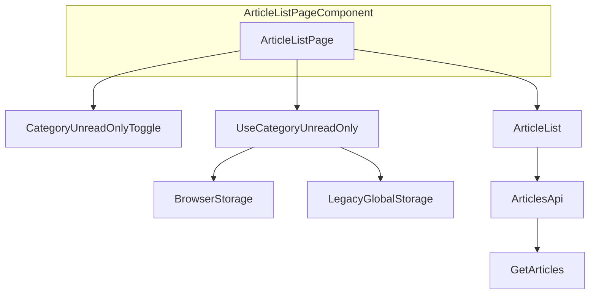
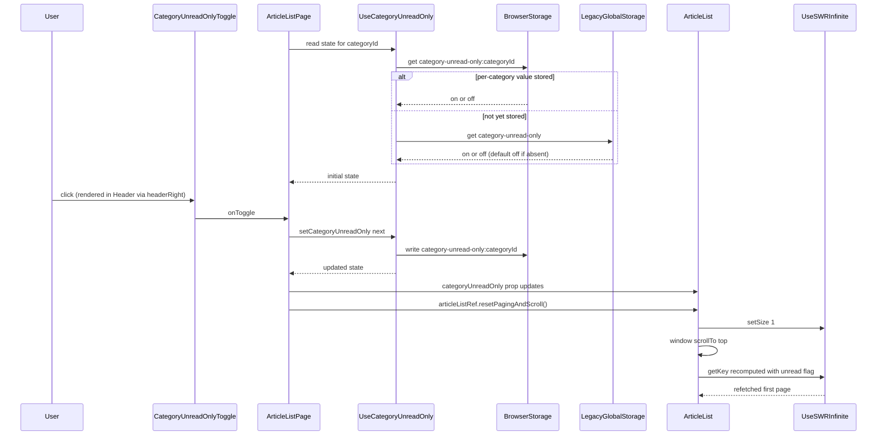

# Technical Design: folder-unread-only-toggle

## Overview

**Purpose**: フォルダ(カテゴリ)の記事一覧に「すべて表示」と「未読のみ表示」を切り替えるトグルを追加し、既読記事に紛れた未読記事のタイトルを見落とさず確認できるようにする。個別フィードで既に提供されている [feed-unread-only-toggle](../feed-unread-only-toggle/design.md) と同じ体験をフォルダ単位でも提供する。

**Users**: フォルダ(カテゴリ)の記事一覧を閲覧する利用者。複数のフォルダを行き来しながら未読記事だけを確認したい場面で使う。

**Impact**: `ArticleList` にフォルダ単位の常時表示トグルを追加する。既存の `unread` 絞り込み(`getArticles` / `GET /api/articles`)をそのまま利用するため、サーバー・DBのAPI変更は無い。表示状態はカテゴリIDをキーにブラウザのローカルストレージへ保存する。既存のグローバルな「カテゴリの未読のみ表示」設定(`reading.category_unread_only`、Settings画面・`use-settings.ts`・サーバーのプリファレンスキー)は本機能に置き換えられ、削除する。

### Goals

- フォルダの記事一覧で「すべて表示」/「未読のみ表示」を切り替えられる
- 切り替えた表示状態をフォルダごとに記憶し、同じフォルダを再訪したときに復元する
- フォルダ間を移動しても前のフォルダの表示状態を誤って引き継がない
- 切り替え時に一覧の先頭から再読み込みする
- 既存のグローバルな「カテゴリの未読のみ表示」設定を置き換え、移行前の値を各フォルダの初期状態に一度だけ反映する
- 表示切り替えの操作を見ただけで、現在のモードと切り替え後のモードをひと目で判別できるようにする(要件9)

### Non-Goals

- 受信箱・個別フィード・ブックマーク・お気に入り・既読済み一覧への適用(個別フィードは feed-unread-only-toggle で対応済み)
- 表示状態のサーバー同期・クロスデバイス同期(移行時の一度限りのフォールバック読み取りを除く)
- 未読以外の観点(お気に入り・いいね・既読)での絞り込み切り替え
- フォルダ(カテゴリ)の作成・編集・削除

## Boundary Commitments

### This Spec Owns

- フォルダ(カテゴリ)の記事一覧における「すべて表示」/「未読のみ表示」の切り替えUIとその文言
- カテゴリIDをキーにした表示状態のブラウザ内永続化(読み込み・保存・フォルダ切り替え時の再導出、および移行時のフォールバック読み取り)
- `ArticleList` の `unreadOnly` 判定へのフォルダ単位の値の合成
- 表示状態切り替え時のページング(`useSWRInfinite` の `size`)リセットとスクロール位置のリセット
- 未読が0件のときの案内表示と、そこから「すべて表示」に戻す導線
- 既存のグローバル「カテゴリの未読のみ表示」設定(`reading.category_unread_only`)の撤去: Settings画面のUI、`use-settings.ts` の同期配線、サーバーのプリファレンスキー定義
- `useCategoryUnreadOnly` の呼び出し元をページコンポーネント(`ArticleListPage`)に置くこと(要件8: 表示位置の永続的な可視性への対応)
- `CategoryUnreadOnlyToggle` を、`feed-unread-only-toggle` が新設したヘッダーの右側アクションスロット(`headerRight`)へ描画すること
- `CategoryUnreadOnlyToggle` から、`feed-unread-only-toggle` が新設する汎用2択トグルスイッチ `UnreadOnlyToggleSwitch`(`src/components/ui/`)を利用し、フォルダ向けのラベルを渡して描画すること(要件9)

### Out of Boundary

- 記事の既読/未読状態そのものを変更する操作(`bulk-mark-read` の責務)
- 未読件数の算出方法、記事の並び順、smart floor を含む一覧の表示範囲の決め方
- `getArticles` / `GET /api/articles` のフィルタAPI自体の変更(既存の `unread` パラメータをそのまま利用)
- 個別フィードの表示切り替え(`feed-unread-only-toggle`)の実装・記憶・復元・引き継ぎロジック
- デモモードのAPIモック実装(`unread` パラメータを既に汎用的に処理しているため変更不要)
- ヘッダーの `headerRight` スロット自体の新設、および `ArticleListHandle.resetPagingAndScroll` の新設(いずれも `feed-unread-only-toggle` が所有する。本機能はこれらを利用するのみ)
- 汎用2択トグルスイッチ `UnreadOnlyToggleSwitch` 自体の新設・配色・見た目の定義(`feed-unread-only-toggle` が所有する。本機能はフォルダ向けラベルを渡して利用するのみで、コンポーネント自体の変更は行わない)
- ヘッダー(`Header`/`PageLayout`)自体の一般的なレイアウト・背景・高さ・タイトルの省略表示規則

### Allowed Dependencies

- クライアント: `src/components/article/article-list.tsx` の既存の `unreadOnly`/`getKey`/`useSWRInfinite` 構成、`src/lib/i18n.ts`、`src/hooks/use-feed-unread-only.ts` と同じローカルストレージ永続化パターン(直接の関数再利用はしない)、`src/hooks/use-scroll-restoration.ts` と同じ `window.scrollTo` によるスクロール制御
- クライアント(移行フォールバックのみ): 旧グローバル設定が書き込んでいた `localStorage` キー `category-unread-only` を読み取り専用で参照する
- クライアント: `src/app.tsx` の `ArticleListPage`、および `feed-unread-only-toggle` が導入する `PageLayout`/`Header` の `headerRight` prop と `ArticleListHandle.resetPagingAndScroll`(新設ではなく再利用。両方とも `feed-unread-only-toggle` の実装を前提とする)
- クライアント: `feed-unread-only-toggle` が新設する `src/components/ui/unread-only-toggle-switch.tsx`(`UnreadOnlyToggleSwitch`)を、フォルダ向けラベルを渡して再利用する(新設ではなく再利用。要件9)
- サーバー: `GET /api/articles` の既存の `unread` クエリパラメータ(変更なしで利用のみ)
- 共有: なし(新しい型はクライアント内に閉じる)

依存の向き: `src/hooks/use-category-unread-only.ts` → `src/components/article/category-unread-only-toggle.tsx` → `src/app.tsx`(`ArticleListPage`)。`ArticleListPage` から `useCategoryUnreadOnly` を直接呼び出し、`CategoryUnreadOnlyToggle` は表示専用としてコールバックのみを受け取る。`ArticleListPage` は `PageLayout` の `headerRight`(`feed-unread-only-toggle` が新設)にトグル要素を渡し、`ArticleList` には `categoryUnreadOnly` の値のみを props で渡す。この向きを逆流する import は許容しない。`CategoryUnreadOnlyToggle` は `feed-unread-only-toggle` が所有する `UnreadOnlyToggleSwitch`(`src/components/ui/`)をフォルダ向けラベルとともに利用する(新設ではなく再利用)。

### Revalidation Triggers

- `getArticles` の `unread` フィルタの意味・パラメータ名が変わったとき
- `ArticleList` の `feedId`/`categoryId` 変化時のリセット用 `useEffect` パターン(現行 415-421行)が削除・変更されたとき。新フックが依拠する再導出のタイミングが崩れる
- `useSWRInfinite` の `size` リセット規約が変わったとき
- `articles.allRead` / `articles.showReadArticles` の文言が個別フィード専用の意味に変更されたとき。本機能での再利用が不適切になる
- 何らかの理由でカテゴリ向けの「グローバルな未読のみ表示」相当の設定が再度追加提案されたとき。本機能が置き換えた経緯(`research.md` の Design Decisions 参照)を必ず参照し、二重の制御を再導入しない
- `feed-unread-only-toggle` が所有する `Header`/`PageLayout` の `headerRight` プロパティ、または `ArticleListHandle.resetPagingAndScroll` のシグネチャ・挙動が変わったとき。本機能はこれらにそのまま依存しているため、変更時は本仕様側の配線も確認する
- `feed-unread-only-toggle` が所有する `UnreadOnlyToggleSwitch` の props 契約(`unreadOnly`/`onChange`/ラベル)や見た目の前提が変わったとき。本機能はこのプリミティブにそのまま依存しているため、変更時は本仕様側の配線も確認する

## Architecture

### Existing Architecture Analysis

`ArticleList`(`src/components/article/article-list.tsx`)は `useSWRInfinite` で `/api/articles` をページ単位に取得し、`unreadOnly`/`bookmarkedOnly`/`likedOnly`/`readOnly`/`noFloor` をクエリパラメータへ変換する `getKey` 関数を持つ。`unreadOnly` は現在 `isInbox || (categoryUnreadOnly && !showReadArticles) || (isPlainFeedView && feedUnreadOnly === 'on')` として算出され、`categoryUnreadOnly` はグローバル設定 `settings.categoryUnreadOnly === 'on'`(全カテゴリ共通)から導出されている。未読0件時は `showReadArticles`(一時的なローカル状態、フィード/カテゴリ変更時にリセット)で既読記事を覗ける。

`ArticleList` は既に `[feedId, categoryId]` の変化を検知する `useEffect`(現行415-421行)を持ち、`showReadArticles`・`noFloor`・`locallyReadIds`・キーボードフォーカスをフィード/カテゴリ切り替え時にリセットしている。ルート(`/categories/:categoryId`)に `key` propが無いため、フォルダ間の移動では `ArticleList` は再マウントされない。`feed-unread-only-toggle` はこの制約下でフィード単位の状態を安全に切り替えるため、`useEffect` で `feedId` の変化ごとに状態を再導出する専用フックを導入した。本機能は同じ制約・同じ解法をカテゴリに適用する。

`feed-unread-only-toggle` は要件7対応として、トグルの状態管理・クリックハンドラをページコンポーネント `ArticleListPage` に置き、`PageLayout`/`Header` に新設した `headerRight` スロットへ描画する構成に変更されている(そのスポットは `ArticleList` とは兄弟関係にある常時表示のヘッダー行)。また `ArticleList` は `resetPagingAndScroll`(`setSize(1)` + `window.scrollTo(0, 0)`)を `ArticleListHandle` 経由で公開するようになっている。本機能(要件8)は同じ仕組みをカテゴリ用トグルにもそのまま適用し、新しいスロットやメソッドを追加で作らない。

### Architecture Pattern & Boundary Map



**Architecture Integration**:
- 選択パターン: `feed-unread-only-toggle` で確立済みの「ルートID変化時にローカル状態を再導出する `useEffect`」パターンを、既存ファイル `src/hooks/use-category-unread-only.ts` を書き換えたフックとして流用する。呼び出し元は `feed-unread-only-toggle` と同じくページコンポーネント `ArticleListPage`
- ドメイン境界: 永続化とフォルダ単位の値の再導出(および移行フォールバック)は `useCategoryUnreadOnly` が所有し、表示とクリックイベントは `CategoryUnreadOnlyToggle` が所有する。`ArticleListPage` は両者を配線し、`headerRight` へ描画するとともに `ArticleList` へ `categoryUnreadOnly` の値を渡して既存の `unreadOnly`/`getKey`/`size` と接続する
- 既存パターンの維持: `unreadOnly` の算出方法(合成のみ変更)、`getKey` によるクエリパラメータ生成、`useSWRInfinite` の利用方法は変更しない
- 撤去: `settings.categoryUnreadOnly`/`showReadArticles` の一時的な仕組みは完全に削除し、`feedUnreadOnly` と対称な `categoryUnreadOnly`(フォルダ単位・永続)に置き換える
- ヘッダースロット・命令的メソッドの再利用: `headerRight` と `resetPagingAndScroll` は `feed-unread-only-toggle` が新設した既存の仕組みをそのまま使い、本機能側で複製・再定義しない(`research.md` 参照)

### Unread-Only Toggle Switch の再利用(要件9)

`feed-unread-only-toggle` の要件8で新設された汎用2択スイッチ `UnreadOnlyToggleSwitch`(`src/components/ui/`)を、`CategoryUnreadOnlyToggle` からそのまま利用する。本機能側で新しいスイッチ実装を作らない(見た目・挙動の重複と乖離を避けるため)。

**Key decisions**:
- `CategoryUnreadOnlyToggle` は `UnreadOnlyToggleSwitch` にフォルダ向けの `aria-label`(既存の `category.unreadOnlyToggle.showAll`/`showUnreadOnly` キー)を渡すのみで、コンポーネント自体は変更しない
- `CategoryUnreadOnlyToggle` の外部向けprops(`{ unreadOnly: boolean; onToggle: () => void }`)は変更しない。`onToggle` は `UnreadOnlyToggleSwitch` の `onChange` から、現在と反対の状態が選択されたときにのみ呼び出される
- 配色・形状・文字サイズは `UnreadOnlyToggleSwitch` が既に既存デザインのテーマトークンのみで実装済みであるため、本機能側での追加のスタイル調整は不要(要件9.4)

### Technology Stack

| Layer | Choice / Version | Role in Feature | Notes |
|-------|------------------|-----------------|-------|
| Frontend | React 18(既存) + SWR(既存 `swr`/`swr/infinite`) | トグルUIの描画と記事一覧の再取得 | 新規ライブラリ追加なし |
| クライアント永続化 | ブラウザ `localStorage`(既存パターンを踏襲、`use-feed-unread-only.ts` と同型) | カテゴリIDごとの表示状態の保存・復元、および移行フォールバック読み取り | サーバー同期なし |
| i18n | `src/lib/i18n.ts`(既存辞書、`ja`/`en`/`zh`) | トグル文言の提供(空状態文言は既存キーを再利用) | 既存の3言語構成に合わせる |

## File Structure Plan

### Directory Structure
```
src/
├── hooks/
│   ├── use-category-unread-only.ts        # Rewritten: per-category unread-only state, localStorage-backed (replaces global setting hook)
│   └── use-category-unread-only.test.ts   # Rewritten: hook unit tests for new per-category behavior
├── components/
│   └── article/
│       ├── category-unread-only-toggle.tsx       # Modified (要件9): compose UnreadOnlyToggleSwitch instead of a text link
│       ├── category-unread-only-toggle.test.tsx  # Modified (要件9): assert both segments render and active-segment highlighting
│       ├── article-list.tsx                       # Modified: categoryUnreadOnly from props, drop showReadArticles
│       └── article-list.test.tsx                  # Modified: replace global-setting test setup with per-category localStorage setup
├── app.tsx                                # Modified: ArticleListPage owns useCategoryUnreadOnly, wires toggle into existing headerRight slot
├── pages/settings/sections/
│   └── reading-section.tsx                # Modified: remove the "カテゴリの未読のみ表示" control
└── lib/
    └── i18n.ts                            # Modified: remove settings.categoryUnreadOnly* keys, add category.unreadOnlyToggle.* keys
server/
└── routes/
    └── settings.ts                        # Modified: remove 'reading.category_unread_only' from PREF_KEYS and PREF_ALLOWED
docs/
└── spec/
    ├── 92_feature_category_unread_only.md # New: feature doc (English, per docs.md rule)
    ├── 87_feature_feed_unread_only.md     # Modified: fix stale reference to the now-removed global category setting
    └── 01_overview.md                     # Modified: register the new doc in the index
README.md                                  # Modified: add a one-line feature bullet
```

> `src/components/layout/header.tsx` / `page-layout.tsx` は本機能では変更しない。両ファイルの `headerRight` prop は `feed-unread-only-toggle` が新設・所有するものを、本機能はそのまま再利用する(Out of Boundary / Allowed Dependencies 参照)。
>
> `src/components/ui/unread-only-toggle-switch.tsx` も本機能では新設・変更しない。`feed-unread-only-toggle`(要件8)が新設・所有するファイルを、`CategoryUnreadOnlyToggle` からそのまま再利用する(Out of Boundary / Allowed Dependencies 参照)。

### Modified Files
- `src/hooks/use-category-unread-only.ts` — Full rewrite: replaces the global `createLocalStorageHook`-based `useCategoryUnreadOnly()` (no args, returns `{categoryUnreadOnly, setCategoryUnreadOnly}`) with a per-category hook `useCategoryUnreadOnly(categoryId)` returning a tuple, mirroring `use-feed-unread-only.ts`'s shape and adding the legacy-value fallback (see Components below).
- `src/app.tsx`(`ArticleListPage`) — Calls `useCategoryUnreadOnly(categoryId)`. When `categoryId !== undefined`, builds a `CategoryUnreadOnlyToggle` element and passes it into `PageLayout`'s existing `headerRight` prop (introduced by `feed-unread-only-toggle`; mutually exclusive with the feed toggle since a route never has both `feedId` and `categoryId`). The toggle's click handler flips state then calls `articleListRef.current?.resetPagingAndScroll()` (the existing imperative method). Passes `categoryUnreadOnly` and an `onCategoryUnreadOnlyChange` callback down to `ArticleList` as props.
- `src/components/article/article-list.tsx` — Removes `showReadArticles` state and the global `categoryUnreadOnly` derivation from `settings`. Receives `categoryUnreadOnly`/`onCategoryUnreadOnlyChange` as props instead of calling `useCategoryUnreadOnly` directly. Extends `unreadOnly` to `isInbox || (categoryId !== undefined && categoryUnreadOnly === 'on') || (isPlainFeedView && feedUnreadOnly === 'on')`. Does not render `CategoryUnreadOnlyToggle` itself (rendered in the header by `ArticleListPage`). Replaces `allReadEmpty` (which depended on `showReadArticles`) with `categoryAllReadEmpty` computed the same way as the existing `feedAllReadEmpty`, and its action calls `onCategoryUnreadOnlyChange('off')` + `setSize(1)` instead of `setShowReadArticles(true)`.
- `src/hooks/use-settings.ts` — Removes the `'reading.category_unread_only'` entry from `Prefs`, the `useCategoryUnreadOnly()` call and its ref/hydration/factory-setter wiring, and `categoryUnreadOnly`/`setCategoryUnreadOnly` from the returned object.
- `src/pages/settings/sections/reading-section.tsx` — Removes the "カテゴリの未読のみ表示" `RadioGroup` block and its destructured props.
- `server/routes/settings.ts` — Removes `'reading.category_unread_only'` from `PREF_KEYS` and `PREF_ALLOWED` (companion change required by `.claude/rules/settings-sync.md`).
- `src/lib/i18n.ts` — Removes `settings.categoryUnreadOnly` / `...Desc` / `...On` / `...Off` (4 keys). Adds `category.unreadOnlyToggle.showUnreadOnly` / `category.unreadOnlyToggle.showAll` in `ja`/`en`/`zh`.
- `src/components/article/category-unread-only-toggle.tsx`(要件9) — Replaces the text-link rendering with `UnreadOnlyToggleSwitch`(`feed-unread-only-toggle` 由来、再利用). External props (`{ unreadOnly, onToggle }`) unchanged. Passes the existing `category.unreadOnlyToggle.showAll`/`showUnreadOnly` strings as each segment's `aria-label` (no new i18n keys needed).
- `docs/spec/87_feature_feed_unread_only.md` — Updates the "Out of Scope" line that currently says the global `reading.category_unread_only` setting is unchanged; it now points to the new doc instead.
- `docs/spec/01_overview.md` — Adds a link to the new doc.
- `README.md` — Adds a one-line feature bullet, mirroring the existing Feed Unread-Only Toggle entry.

## System Flows

トグル切り替え時の状態更新とページング・スクロールのリセットは複数ステップにまたがるため、シーケンス図で明示する。移行フォールバックは初回読み込み時の分岐として同じ図に含める。



**Key decisions**: フォールバック(`Legacy` 分岐)は読み取り専用で、書き戻しを行わない。旧グローバル設定を書いていた仕組み(Settings画面・`use-settings.ts`)は本機能で撤去されるため、`Legacy` の値はこの変更のデプロイ時点で固定される。これにより「一度だけ適用する」動作が、明示的な移行フラグや書き戻し処理なしに、`readStored` の優先順位(カテゴリ別値 → レガシー値 → `'off'`)だけで実現される(`research.md` の Design Decisions 参照)。

## Requirements Traceability

| Requirement | Summary | Components | Interfaces | Flows |
|-------------|---------|------------|------------|-------|
| 1.1 | フォルダページでトグルを提供する | ArticleList, CategoryUnreadOnlyToggle | — | — |
| 1.2 | 受信箱・個別フィード・その他一覧ではトグルを出さない | ArticleList | `categoryId !== undefined` 判定 | — |
| 1.3 | 未読のみ表示で既読記事を除外する | ArticleList | `unreadOnly` 合成、`getKey` | トグル切り替えシーケンス |
| 1.4 | すべて表示で既読・未読を表示する | ArticleList | `unreadOnly` 合成 | トグル切り替えシーケンス |
| 1.5 | 現在の表示状態を判別できるようにする | CategoryUnreadOnlyToggle | Props `unreadOnly` | — |
| 2.1 | 未読が無い場合の案内表示 | ArticleList | `categoryAllReadEmpty` 算出 | — |
| 2.2 | 案内表示から「すべて表示」に戻せる | ArticleList | 既存 `articles.showReadArticles` ボタンの再利用、`setCategoryUnreadOnly('off')` | — |
| 3.1-3.2 | フォルダごとに表示状態を記憶・復元 | UseCategoryUnreadOnly | `useCategoryUnreadOnly(categoryId)` | 初期読み込みシーケンス |
| 3.3 | 同じ端末の同じブラウザでのみ復元 | UseCategoryUnreadOnly | `localStorage` 利用(サーバー同期なし) | — |
| 4.1 | 移行前のグローバル設定値を初期状態として一度だけ適用 | UseCategoryUnreadOnly | レガシー `localStorage` キーへのフォールバック読み取り | 初期読み込みシーケンス |
| 4.2 | Settings画面からグローバル切り替えを撤去 | reading-section.tsx, use-settings.ts, server/routes/settings.ts | — | — |
| 4.3 | 記憶後はレガシー設定を参照しない | UseCategoryUnreadOnly | `readStored` の優先順位(カテゴリ別値が最優先) | 初期読み込みシーケンス |
| 5.1-5.2 | フォルダ間切り替えでの状態の非引き継ぎ | UseCategoryUnreadOnly | `categoryId` 変化時の再導出 `useEffect` | — |
| 6.1-6.2 | 切り替え時の先頭からの再読み込み | ArticleListPage, ArticleList | `ArticleListHandle.resetPagingAndScroll`(`feed-unread-only-toggle` 由来、再利用) | トグル切り替えシーケンス |
| 7.1 | 文言の多言語提供 | i18n dictionary | `category.unreadOnlyToggle.*`、既存 `articles.allRead`/`articles.showReadArticles` | — |
| 8.1 | スクロール中もトグルを表示し続ける | Header, PageLayout(`feed-unread-only-toggle` が新設、本機能は再利用) | `headerRight` prop | — |
| 8.2 | フォルダ名と同じ常時表示領域に配置する | Header, PageLayout, ArticleListPage | `headerRight` prop | トグル切り替えシーケンス |
| 8.3 | フォルダ名の文字数でトグルの位置が変わらない | Header | 右側スロットの固定配置(`headerRight` はタイトルの `flex-1` 領域と独立) | — |
| 9.1 | 両方の選択肢を常に視認できる形で示す | UnreadOnlyToggleSwitch(feed-unread-only-toggle 由来、再利用) | 2セグメントの常時描画 | — |
| 9.2 | 現在選択されている側を区別できるように強調する | UnreadOnlyToggleSwitch(feed-unread-only-toggle 由来、再利用) | アクティブセグメントのテーマトークン強調(`bg-accent`/`text-accent-text`) | — |
| 9.3 | 切り替え直後に選択状態を即座に反映する | UnreadOnlyToggleSwitch, CategoryUnreadOnlyToggle | `onChange` → `onToggle` の同期呼び出し | トグル切り替えシーケンス |
| 9.4 | 配色・形状・文字サイズを既存デザインと一貫させる | UnreadOnlyToggleSwitch(feed-unread-only-toggle 由来、再利用) | 既存 `Button` と同じテーマトークンの利用、新規トークン追加なし | — |

## Components and Interfaces

| Component | Domain/Layer | Intent | Req Coverage | Key Dependencies (P0/P1) | Contracts |
|-----------|--------------|--------|---------------|---------------------------|-----------|
| useCategoryUnreadOnly | Client State | カテゴリIDごとの表示状態を保持・永続化し、未記憶時はレガシー設定値へフォールバックする | 3.1-3.3, 4.1, 4.3, 5.1-5.2 | BrowserStorage (P0) | State |
| CategoryUnreadOnlyToggle | UI | トグルの表示とクリックイベントの通知(`UnreadOnlyToggleSwitch` を利用) | 1.1, 1.5, 7.1, 9.1-9.4 | useCategoryUnreadOnly の戻り値 (P0), UnreadOnlyToggleSwitch (P0, feed-unread-only-toggle 由来) | State |
| ArticleListPage(変更箇所) | UI / Integration | `useCategoryUnreadOnly` の呼び出し、`CategoryUnreadOnlyToggle` の生成、既存 `headerRight` への配線、トグル操作時の `resetPagingAndScroll` 呼び出し | 1.1, 1.5, 6.1-6.2, 8.1-8.3 | useCategoryUnreadOnly (P0), CategoryUnreadOnlyToggle (P0), PageLayout の headerRight (P0, feed-unread-only-toggle 由来), ArticleListHandle (P0, feed-unread-only-toggle 由来) | State |
| ArticleList(変更箇所) | UI / Integration | フォルダ判定、`unreadOnly` 合成、空状態の置き換え | 1.1-1.4, 2.1-2.2, 6.1-6.2 | CategoryUnreadOnly prop (P0), useSWRInfinite (P0) | State |
| Settings撤去(reading-section.tsx / use-settings.ts / server settings.ts) | UI / Integration | 既存グローバル設定のUI・同期・サーバー側許可値を撤去する | 4.2 | — | — |

### Client State

#### useCategoryUnreadOnly

| Field | Detail |
|-------|--------|
| Intent | カテゴリIDをキーに「すべて表示/未読のみ表示」の状態を保持し、`localStorage` に永続化する。未記憶のカテゴリは、旧グローバル設定が残した `localStorage` 値へフォールバックする |
| Requirements | 3.1, 3.2, 3.3, 4.1, 4.3, 5.1, 5.2 |

**Responsibilities & Constraints**
- 状態は `categoryId` ごとに独立し、`categoryId` が変化したら対応する保存値(無ければフォールバック値)へ再導出する
- `createLocalStorageHook` は使わない。`use-feed-unread-only.ts` と同じ理由(動的キーの再導出に不向き)による
- `categoryId` が `undefined` のとき(フォルダページ以外)は常に `'off'` を返し、書き込みも行わない
- カテゴリ別キーが未保存のとき、レガシーキー `category-unread-only`(旧グローバル設定が書き込んでいたキー)を読み取り専用で参照し、値が `'on'` ならフォールバック値を `'on'`、それ以外は `'off'` とする。この読み取りはレガシーキーへの書き戻しを一切行わない

**Dependencies**
- Outbound: `window.localStorage` — 永続化・レガシー値の読み取り (P0)

**Contracts**: Service [x] / API [ ] / Event [ ] / Batch [ ] / State [x]

##### Service Interface
```typescript
export type CategoryUnreadOnly = 'on' | 'off'

export function useCategoryUnreadOnly(
  categoryId: number | undefined,
): [CategoryUnreadOnly, (next: CategoryUnreadOnly) => void]
```
- Preconditions: `categoryId` is `undefined` when the current route is not a category (folder) page.
- Postconditions: The returned state reflects the value stored under this `categoryId`; if none is stored, it reflects the legacy global value (`'on'` if the legacy key is exactly `'on'`, else `'off'`). Calling the setter persists the new value under a `categoryId`-scoped key and the returned state updates on the next render.
- Invariants: The state is re-derived from storage whenever `categoryId` changes; no value from one `categoryId` is ever returned for a different `categoryId`. Once a `categoryId`-scoped key has been written, it always takes priority over the legacy fallback for that `categoryId`.

##### State Management
- State model: `useState<CategoryUnreadOnly>` initialized lazily from storage for the current `categoryId`, mirrored to storage on every setter call
- Persistence & consistency: `localStorage` key pattern `category-unread-only:{categoryId}`, value `'on'` or `'off'`; unrecognized stored values fall back through the same legacy-then-off chain as an absent key. Legacy fallback key: `category-unread-only` (owned historically by the removed global hook; read-only from this point on)
- Concurrency strategy: 単一タブ内のReact状態のみを信頼源とする。他タブでの変更検知は行わない(`use-feed-unread-only.ts` と同様)

**Implementation Notes**
- Integration: `ArticleListPage` から `categoryId`(フォルダページのときのみ、それ以外は `undefined`)を渡して利用する
- Validation: 不正な保存値は「未保存」と同様に扱い、レガシーフォールバックへ進む
- Risks: `localStorage` が利用不可な場合の挙動は既存パターンと同じ(アプリ全体で統一されており、本機能だけの特別対応はしない)。レガシーキーは今後誰も書き込まなくなるため、フォールバック値はこの変更のデプロイ時点の値に固定される(意図した挙動、`research.md` 参照)

### UI

#### CategoryUnreadOnlyToggle

| Field | Detail |
|-------|--------|
| Intent | `UnreadOnlyToggleSwitch`(`feed-unread-only-toggle` 由来、再利用)にフォルダ向けのラベルを渡して描画し、選択が変わったときに `onToggle` へ通知する |
| Requirements | 1.1, 1.5, 7.1, 9.1-9.4 |

**Responsibilities & Constraints**
- 表示専用。状態の保持・永続化ロジックを持たない
- `FeedUnreadOnlyToggle` と同一の `UnreadOnlyToggleSwitch` を利用し、同一の見た目・操作パターンを踏襲する(要件9)。コンポーネント自体の新設・変更は行わない
- 外部向けprops(`{ unreadOnly, onToggle }`)は変更しない。既存の `category.unreadOnlyToggle.showAll`/`showUnreadOnly` の文言を、`UnreadOnlyToggleSwitch` の `showAllLabel`/`unreadOnlyLabel` としてそのまま渡す

```typescript
interface CategoryUnreadOnlyToggleProps {
  unreadOnly: boolean
  onToggle: () => void
}
```

**Implementation Notes**
- Integration: `ArticleListPage` がフォルダページ判定(`categoryId !== undefined`)のときのみ生成し、`PageLayout` の既存 `headerRight`(`feed-unread-only-toggle` 由来)に渡す
- Validation: 該当なし(表示専用)
- Risks: 該当なし

### Integration

#### ArticleListPage(変更箇所)

| Field | Detail |
|-------|--------|
| Intent | フォルダ判定、`useCategoryUnreadOnly` と `CategoryUnreadOnlyToggle` の配線、既存 `headerRight` への描画、トグル操作時の状態更新と `ArticleList` のページング・スクロールリセットの発火 |
| Requirements | 1.1, 1.5, 6.1, 6.2, 8.1-8.3 |

**Responsibilities & Constraints**
- `categoryId !== undefined` のとき `useCategoryUnreadOnly(categoryId)` を呼び出し、`CategoryUnreadOnlyToggle` を生成して `PageLayout` の `headerRight` に渡す(`feed-unread-only-toggle` が同じ prop にフィード用トグルを渡すが、`categoryId` と `feedId` はルーティング上排他的なため競合しない)
- トグルのクリックハンドラは、状態の反転(`setCategoryUnreadOnly`)ののち `articleListRef.current?.resetPagingAndScroll()`(`feed-unread-only-toggle` が導入した既存メソッド)を呼ぶ。本機能はこのメソッドを再利用するのみで、新設・複製はしない
- `ArticleList` へは `categoryUnreadOnly` の値と `onCategoryUnreadOnlyChange`(空状態導線用)を props として渡す

**Dependencies**
- Inbound: なし(ルートに直接マッピングされるページコンポーネント)
- Outbound: `useCategoryUnreadOnly` (P0), `CategoryUnreadOnlyToggle` (P0), `PageLayout` の `headerRight` (P0, feed-unread-only-toggle 由来), `ArticleListHandle.resetPagingAndScroll` (P0, feed-unread-only-toggle 由来)

**Contracts**: Service [ ] / API [ ] / Event [ ] / Batch [ ] / State [x]

##### State Management
- State model: `categoryUnreadOnly`(`useCategoryUnreadOnly` の戻り値)をページコンポーネントの状態として保持する
- Persistence & consistency: 永続化は `useCategoryUnreadOnly` に委譲する
- Concurrency strategy: 該当なし(単一コンポーネント内の同期的な状態更新)

**Implementation Notes**
- Integration: `feed-unread-only-toggle` も同じ `ArticleListPage` にフィード用の配線を持つ。`categoryId !== undefined` と `isPlainFeedView` は現在のルーティング上、同時にtrueにならない(カテゴリページとフィードページは別ルート)ため、`headerRight` の内容が競合することはない
- Validation: 該当なし
- Risks: 該当なし

#### ArticleList(変更箇所)

| Field | Detail |
|-------|--------|
| Intent | フォルダ判定、`unreadOnly` への合成、空状態表示の置き換え |
| Requirements | 1.2, 1.3, 1.4, 2.1, 2.2, 6.1, 6.2 |

**Responsibilities & Constraints**
- `categoryUnreadOnly`(props)を受け取り、`unreadOnly` の算出を `isInbox || (categoryId !== undefined && categoryUnreadOnly === 'on') || (isPlainFeedView && feedUnreadOnly === 'on')` に変更する(既存の `categoryUnreadOnly && !showReadArticles` 由来の項を置き換える)
- `showReadArticles` state を削除し、既存の `allReadEmpty` を `categoryAllReadEmpty = isEmpty && categoryId !== undefined && categoryUnreadOnly === 'on' && totalAll != null && totalAll > 0` に置き換える(`feedAllReadEmpty` と対称)。空状態のレンダリング条件を `categoryAllReadEmpty || feedAllReadEmpty` に変更する。案内のボタンは `categoryAllReadEmpty` のときは `onCategoryUnreadOnlyChange('off')` を呼んだのち `setSize(1)` する
- フィード/カテゴリ変更時のリセット `useEffect`(現行415-421行)から `setShowReadArticles(false)` を削除する(状態自体を削除するため)

**Dependencies**
- Inbound: `ArticleListPage`(`categoryUnreadOnly`/`onCategoryUnreadOnlyChange` props)
- Outbound: `useSWRInfinite` の `setSize` (P0)

**Contracts**: Service [ ] / API [ ] / Event [ ] / Batch [ ] / State [x]

##### State Management
- State model: `categoryUnreadOnly` は props 由来の値として扱う(このコンポーネントは所有しない)。`showReadArticles` は廃止する
- Persistence & consistency: 永続化は `useCategoryUnreadOnly`(呼び出し元は `ArticleListPage`)に委譲する
- Concurrency strategy: 既存の `useSWRInfinite` の再検証・重複リクエスト制御をそのまま利用する

**Implementation Notes**
- Integration: トグル自体の描画は行わない(ヘッダー側で `ArticleListPage` が描画する)。`categoryId` と `isPlainFeedView` は現在のルーティング上、同時にtrueにならない(カテゴリページとフィードページは別ルート)。両トグルが同時に描画されることはない
- Validation: 該当なし
- Risks: `categoryAllReadEmpty` と `feedAllReadEmpty` が同時にtrueになるケースが無いことを実装時に確認する(既存の `allReadEmpty`/`feedAllReadEmpty` の相互排他性コメントと同じ根拠)

### Settings 撤去

| Field | Detail |
|-------|--------|
| Intent | グローバルな「カテゴリの未読のみ表示」設定のUI・フロント同期・サーバー許可値を撤去する |
| Requirements | 4.2 |

**Responsibilities & Constraints**
- `src/pages/settings/sections/reading-section.tsx`: 該当の `RadioGroup` ブロックと関連の分割代入を削除する
- `src/hooks/use-settings.ts`: `Prefs['reading.category_unread_only']`、`useCategoryUnreadOnly()` の呼び出しと関連する ref・hydrationMap エントリ・依存配列・ファクトリセッター・戻り値プロパティを削除する
- `server/routes/settings.ts`: `PREF_KEYS` と `PREF_ALLOWED` から `'reading.category_unread_only'` を削除する(`.claude/rules/settings-sync.md` に従い両側を同時に変更する)
- `src/lib/i18n.ts`: `settings.categoryUnreadOnly` / `...Desc` / `...On` / `...Off` の4キーを削除する

**Implementation Notes**
- Integration: フロントエンドとサーバーの変更は同一コミットで行う(`.claude/rules/settings-sync.md` の警告どおり、片側だけの変更は既存ユーザーのPATCH呼び出しで400エラーを招く)
- Validation: 該当なし
- Risks: サーバー側に残る既存ユーザーの `reading.category_unread_only` プリファレンス行は参照されなくなるだけで、削除やマイグレーションは不要(無害なデータとして残置する)

## Data Models

### Logical Data Model

サーバー側のデータモデルに変更は無い(プリファレンスキー `reading.category_unread_only` の削除を除く)。クライアント側の永続化のみ、以下の形で `localStorage` に保持する。

| Key pattern | Value | Scope |
|---|---|---|
| `category-unread-only:{categoryId}` | `'on'` \| `'off'` | ブラウザ単位、カテゴリID単位(新規) |
| `category-unread-only`(レガシー) | `'on'` \| `'off'` | ブラウザ単位、全カテゴリ共通(読み取り専用のフォールバック元、新規の書き込みは無い) |

`categoryId` に対応するキーが存在しない場合はレガシーキーの値へフォールバックし、レガシーキーも存在しなければ `'off'` とする。サーバー・DBとの同期は行わない(Non-Goals参照)。

## Error Handling

### Error Strategy
本機能はクライアントローカルの状態切り替えのみで、サーバーへの書き込みを伴わないため、業務エラーは発生しない。既存パターンと同様、`localStorage` へのアクセス失敗(プライベートモード等)に対する特別なフォールバック処理はアプリ全体の既存方針に合わせて追加しない。

### Error Categories and Responses
- 該当なし(新規のAPI呼び出し・サーバーエラーを伴わない)

## Testing Strategy

### Unit Tests
- `useCategoryUnreadOnly`: `categoryId` に対応する保存値が無く、レガシーキーも無いとき `'off'` を返す
- `useCategoryUnreadOnly`: `categoryId` に対応する保存値が無いが、レガシーキーが `'on'` のとき `'on'` を返す(移行フォールバック)
- `useCategoryUnreadOnly`: `categoryId` に対応する保存済みの値がレガシーキーの値より優先される
- `useCategoryUnreadOnly`: `categoryId` が変化したとき、直前の `categoryId` の値を引き継がず、新しい `categoryId` に対応する値(無ければフォールバック)へ再導出する
- `useCategoryUnreadOnly`: セッターの呼び出しで `categoryId` に対応するキーへ保存され、以後はレガシーキーの値に関わらずその保存値が使われる
- `useCategoryUnreadOnly`: `categoryId` が `undefined` のとき、常に `'off'` を返し保存も行わない

### Component Tests
- `CategoryUnreadOnlyToggle`: `unreadOnly` の値に関わらず、「すべて表示」「未読のみ表示」の両方のセグメントが常に描画される(要件9.1、`UnreadOnlyToggleSwitch` 自体のテストは `feed-unread-only-toggle` 側で実施済み)
- `CategoryUnreadOnlyToggle`: `unreadOnly=false`/`true` のいずれでも、両方のセグメントの `aria-label` が既存の `category.unreadOnlyToggle.*` 文言で描画される(要件7.1, 9.1)
- `CategoryUnreadOnlyToggle`: 現在の状態と異なるセグメントをクリックすると `onToggle` が呼ばれる。現在の状態と同じセグメントをクリックしても `onToggle` は呼ばれない(旧: 常に `onToggle` が呼ばれる、というテキストリンク時代の前提を置き換える回帰防止テスト)

### Integration Tests(`article-list.test.tsx`)
- `categoryUnreadOnly` prop が `'on'` のとき `getKey` が生成するリクエストに `unread=1` が含まれる
- 未読のみ表示で対象フォルダの未読が0件のとき、案内表示(既存の `articles.allRead`/`articles.showReadArticles` 文言)が出て、クリックで `onCategoryUnreadOnlyChange('off')` が呼ばれ一覧が再読み込みされる
- `ArticleList` はトグル自体を描画しない(ヘッダー側の責務であることの回帰防止)
- 既存テストのグローバル設定モック(`mockSettings.categoryUnreadOnly`)を、`localStorage` ベースの per-category セットアップに置き換える(旧グローバル設定の削除に伴う既存テストの更新)

### Integration Tests(`app.test.tsx` などページレベル)
- フォルダページ(`categoryId` あり)でのみ `CategoryUnreadOnlyToggle` が既存の `headerRight` 経由で描画される
- 受信箱・個別フィード・ブックマーク・お気に入り・既読済み・クリップの各ビューではフォルダ用トグルが描画されない
- トグルをクリックすると `categoryUnreadOnly` が反転し、`ArticleListHandle.resetPagingAndScroll` が呼ばれる(`feed-unread-only-toggle` が導入した既存メソッドを再利用していることの確認であり、新しいメソッドを追加しない)
- 別フォルダへ遷移したとき、遷移先フォルダの記憶済み表示状態(または初期状態)が反映され、遷移元の状態を引き継がない
- フィードページとフォルダページを行き来しても、`headerRight` に描画される内容が正しく切り替わり、両方のトグルが同時に描画されることはない
