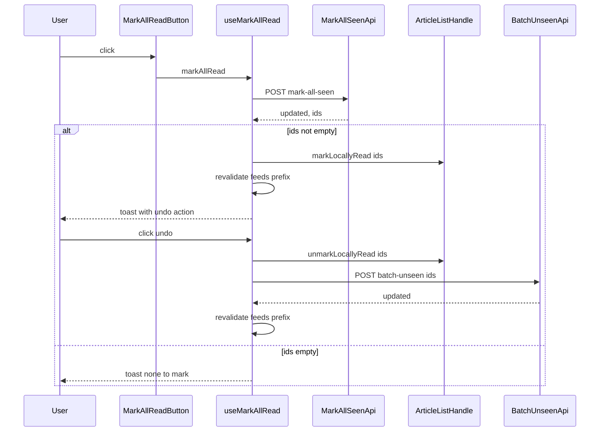

# Design Document

## Overview

**Purpose**: フィードページまたはフォルダ(カテゴリ)ページを閲覧中の利用者に、画面内のボタン1つでそのフィード/フォルダの未読記事をすべて既読にする手段を提供する。

**Users**: 特定のフィードまたはフォルダの記事一覧を確認しており、確認を終えて未読件数をリセットしたい利用者。

**Impact**: サイドバーの右クリックメニュー(既存、変更なし)に加えて、フィード/フォルダ画面のヘッダーに同等の操作を追加する。既読化の対象範囲・意味づけは既存の`markAllSeenByFeed` / `markAllSeenByCategory`と完全に同一。新規に、既読にした記事IDをレスポンスへ含めることで、取り消し可能なトースト通知を追加する。

### Goals
- フィードページ・フォルダページの画面内から、確認操作なしで即座に全件既読を実行できる
- 実行結果を件数付きの通知で示し、少なくとも10秒間は取り消せる
- 既存の記事単位の一括既読(`bulk-mark-read`)が確立したトースト+取り消し体験と一貫させる

### Non-Goals
- Inbox(全フィード横断)ビューへの同様のボタン追加
- サイドバーの右クリックメニューの変更
- 基準記事・方向を指定した範囲既読(`bulk-mark-read`の責務)
- 実行前の確認ダイアログ

## Boundary Commitments

### This Spec Owns
- フィードページ・フォルダページのヘッダーに表示する既読化ボタンのUIと表示条件
- ボタン押下から結果通知・取り消しまでを一気通貫で扱うクライアント側フック
- `markAllSeenByFeed` / `markAllSeenByCategory`のレスポンスへの既読化対象IDの追加(サーバーDB層)
- `ArticleListHandle`への、既読の見た目をローカルに反映/巻き戻すための新規メソッド

### Out of Boundary
- サイドバーの右クリックメニュー(`FeedContextMenu` / `CategoryContextMenu`)とその既存フック(`use-feed-actions.ts`の`handleMarkAllReadFeed` / `handleMarkAllReadCategory`) — 変更しない
- 記事単位・範囲指定の一括既読(`POST /api/articles/range-seen`、`use-bulk-mark-read.ts`) — 変更しない。取り消し用の`POST /api/articles/batch-unseen`のみ依存として利用する
- `getArticles`のフィルタ条件生成、未読件数の算出ロジック、一覧の並び順
- 「未読のみ表示」トグル(`feed-unread-only-toggle` / `folder-unread-only-toggle`)自体の挙動

### Allowed Dependencies
- `POST /api/articles/batch-unseen`(既存・変更なし)— 取り消しの実行に使用
- `ArticleListHandle` ref(既存・メソッド追加のみ)— 既読の見た目をローカルに反映
- sonner の`toast`(既存・`app.tsx`ですでに`<Toaster>`が設定済み)
- `src/lib/i18n.ts`の`t()`

### Revalidation Triggers
- `markAllSeenByFeed` / `markAllSeenByCategory`、または対応するルートのレスポンス契約(`{ updated, ids }`)が変わった場合
- `POST /api/articles/batch-unseen`の受け付け条件(誰の記事IDでも未読化できる、という前提)が変わった場合
- `ArticleListHandle`のメソッド構成やオーナーシップが変わった場合
- サイドバーの`use-feed-actions.ts`側の`mark-all-seen`呼び出しが、本specが依存する契約と異なる形に変更された場合

## Architecture

### Existing Architecture Analysis
- `ArticleListPage`(`src/app.tsx`)がフィード/フォルダ/Inbox等のルートを一括で扱い、`PageLayout`の`headerRight`スロットに、フィードページなら`FeedUnreadOnlyToggle`、フォルダページなら`CategoryUnreadOnlyToggle`を条件分岐で渡している。`isPlainFeedView`と`categoryIdNum !== undefined`は排他的で、Inbox・ブックマーク・お気に入り・履歴・クリップのいずれのビューでも成立しない。
- `ArticleList`(`src/components/article/article-list.tsx`)は`locallyReadIds`という`Set<number>`のローカルオーバーレイを持ち、スクロール自動既読と記事単位の一括既読(`useBulkMarkRead`)の双方がこれを介して、記事一覧を再取得せずに既読の見た目を即座に反映している。`ArticleListHandle`(`revalidate`, `resetPagingAndScroll`)を通じて、ページ側からrefで呼び出し可能な操作を公開済み。
- `useBulkMarkRead`(`src/hooks/use-bulk-mark-read.ts`)がトースト表示・10秒間の取り消し・失敗時ロールバックのパターンを確立しており、未読件数の再検証を`/api/feeds`プレフィックスのSWRキーに限定し、意図的に`/api/articles`(記事一覧そのもの)は再検証しない。
- `markAllSeenByFeed`(`server/db/articles.ts`) / `markAllSeenByCategory`(`server/db/categories.ts`)は対象記事IDを内部で収集済みだが、レスポンスは`{ updated }`のみ。

### Architecture Pattern & Boundary Map



**Architecture Integration**:
- 選択パターン: 既存の「ページ ⇄ `ArticleListHandle`(ref)⇄ `ArticleList`」という境界をそのまま拡張し、新しい状態層を作らない。
- ドメイン境界: サーバー側の変更は`markAllSeenByFeed` / `markAllSeenByCategory`のレスポンス形状のみに限定。クライアント側は新規フック1つ・新規コンポーネント1つ・`ArticleListHandle`へのメソッド追加・`app.tsx`での配線に限定。
- 既存パターンの維持: sonnerトースト、`/api/feeds`プレフィックス方式のSWR再検証、ref経由のページ⇄一覧連携、i18n辞書。
- 新規コンポーネントの理由: 「スコープ全体を対象にした既読化」と「トースト+取り消し+ローカル反映」を組み合わせた要素が既存になく、サイドバー版(`use-feed-actions.ts`)はトースト・取り消しを持たず、`useBulkMarkRead`は基準記事・方向前提で「フィード/フォルダ全体」を表現できない。

### Technology Stack

| Layer | Choice / Version | Role in Feature | Notes |
|-------|------------------|-----------------|-------|
| Frontend | React 19 + SWR(既存) | ボタンコンポーネントとフックの実装 | 新規依存ライブラリなし |
| Frontend (通知) | sonner(既存) | トースト表示・取り消しアクション | `app.tsx`の`<Toaster>`をそのまま利用 |
| Backend | Fastify + zod(既存) | レスポンス形状の拡張 | ルートの受け入れロジックは変更なし |
| Data | SQLite(既存, better-sqlite3) | `markAllSeenByFeed` / `markAllSeenByCategory`が既に収集済みのIDを返すだけ | スキーマ変更・マイグレーション不要 |

## File Structure Plan

### New Files
```
src/
├── hooks/
│   └── use-mark-all-read.ts        # target(feed|category)を受け取り、実行・通知・取り消しを一括管理
├── components/article/
│   └── mark-all-read-button.tsx    # ヘッダーに表示する既読化ボタン(UIのみ、ロジックはフックに委譲)
```

### Modified Files
- `shared/types.ts` — `MarkAllSeenResponse { updated: number; ids: number[] }`を追加(`RangeSeenResponse`と同形状)。`MarkAllReadTarget = { type: 'feed'; id: number } | { type: 'category'; id: number }`を追加。
- `server/db/articles.ts` — `markAllSeenByFeed`の戻り値に、既存で収集済みの`affectedIds`を`ids`として追加。返り値の型を`MarkAllSeenResponse`相当に変更。
- `server/db/categories.ts` — `markAllSeenByCategory`に同様の変更。
- `server/routes/feeds.ts` / `server/routes/categories.ts` — ルートハンドラは関数の戻り値をそのまま`reply.send`しているため実質的な変更なし(型の追従のみ)。
- `src/components/article/article-list.tsx` — `ArticleListHandle`に`markLocallyRead(ids: number[])` / `unmarkLocallyRead(ids: number[])`を追加し、既存の`addLocallyReadIds` / `removeLocallyReadIds`に委譲する`useImperativeHandle`の拡張。
- `src/app.tsx`(`ArticleListPage`) — `isPlainFeedView` / `categoryIdNum`から`MarkAllReadTarget`を導出し、`headerRight`に既存トグルと並べて`MarkAllReadButton`を追加。`onMarkedLocally` / `onUnmarkedLocally`を`articleListRef`経由のコールバックとして渡す。
- `src/lib/i18n.ts` — ボタン文言、トースト文言(件数あり/なし/失敗/取り消し済み/取り消し失敗)を日本語・英語で追加。
- `src/lib/demo/demo-store.ts` — `markAllSeenByFeed` / `markAllSeenByCategory`の戻り値に、既存の対象記事フィルタから求めた`ids`を追加(本番と同じ`{ updated, ids }`形状に統一)。
- `src/lib/demo/mock-api.ts` — 上記デモストアの戻り値をそのまま返すだけであれば変更不要。戻り値の形状が変わる場合はレスポンス組み立て箇所のみ調整。

> Modified Filesは全て既存ファイルへの局所的な追加であり、新しいディレクトリや層は導入しない。

## Requirements Traceability

| Requirement | Summary | Components | Interfaces | Flows |
|-------------|---------|------------|------------|-------|
| 1.1, 1.2, 1.4, 1.5 | ボタンの表示条件(フィード/フォルダのみ、i18n) | `MarkAllReadButton`, `ArticleListPage` | `MarkAllReadButtonProps` | headerRight配線 |
| 1.3 | 未読のみ表示トグルの状態に関わらず表示 | `ArticleListPage` | - | headerRight配線(トグル状態を条件に含めない) |
| 2.1, 2.2, 2.3 | 確認なしの即時全件既読、未読み込み記事も対象 | `useMarkAllRead`, `markAllSeenByFeed`, `markAllSeenByCategory` | `MarkAllSeenResponse` | シーケンス図: click→POST mark-all-seen |
| 2.4 | 重複実行の防止 | `useMarkAllRead` | `UseMarkAllReadResult.isPending` | - |
| 3.1, 3.2 | 見た目・未読件数の即時反映 | `useMarkAllRead`, `ArticleListHandle.markLocallyRead` | `ArticleListHandle` | シーケンス図: markLocallyRead, revalidate feeds |
| 3.3 | 未読のみ表示中でも一覧から即座に消さない | `useMarkAllRead`(revalidation戦略) | - | `/api/articles`を再検証しない設計 |
| 4.1〜4.5, 4.7 | 通知・取り消し・取り消し完了時の巻き戻し | `useMarkAllRead` | `MarkAllReadButtonProps`, `POST /api/articles/batch-unseen` | シーケンス図: toast action→undo |
| 4.6 | 対象0件時の通知(取り消しなし) | `useMarkAllRead` | `MarkAllSeenResponse.ids` | シーケンス図: ids empty分岐 |
| 5.1, 5.2, 5.3 | 失敗時の通知と状態維持 | `useMarkAllRead` | - | シーケンス図のエラー分岐(catch) |

## Components and Interfaces

| Component | Domain/Layer | Intent | Req Coverage | Key Dependencies (P0/P1) | Contracts |
|-----------|--------------|--------|--------------|--------------------------|-----------|
| MarkAllReadButton | UI (article) | ヘッダー内の既読化ボタン表示 | 1.1-1.5, 2.4 | useMarkAllRead (P0) | State |
| useMarkAllRead | Hook (article) | 実行・通知・取り消し・ローカル反映のオーケストレーション | 2.1-2.4, 3.1-3.3, 4.1-4.7, 5.1-5.3 | POST mark-all-seen (P0), POST batch-unseen (P0), ArticleListHandle (P0), sonner toast (P1) | Service, API |
| markAllSeenByFeed / markAllSeenByCategory | DB (server) | 対象記事を既読化しIDを返す | 2.1-2.3, 4.6 | active_articles view (P0) | Service |
| ArticleListHandle(拡張) | UI (article, 既存) | 既読の見た目をローカルに反映/巻き戻す口を公開 | 3.1, 3.3, 4.4-4.5 | article-list内部状態(P0) | State |

### Article / Header

#### MarkAllReadButton

| Field | Detail |
|-------|--------|
| Intent | フィード/フォルダのヘッダーに表示する既読化ボタン。クリック処理は`useMarkAllRead`に委譲する |
| Requirements | 1.1, 1.2, 1.3, 1.4, 1.5, 2.4 |

**Responsibilities & Constraints**
- 表示条件の判定(feedページ/categoryページのどちらか)は呼び出し元(`ArticleListPage`)が`target`の有無で決め、本コンポーネントは`target`が渡された場合のみ描画される
- `isPending`中はボタンを無効化し、二重クリックを防ぐ(実際の重複実行防止は`useMarkAllRead`内部のガードが担い、ボタン側はUI上の抑止のみ)

**Dependencies**
- Outbound: `useMarkAllRead` — 実行ロジック全体(P0)

**Contracts**: Service [ ] / API [ ] / Event [ ] / Batch [ ] / State [x]

##### State Management
- State model: `isPending`のみを`useMarkAllRead`から受け取り、ボタンの`disabled`属性に反映する
- 永続化なし(ページ遷移でアンマウントされれば状態は破棄される)

**Implementation Notes**
- Integration: `src/app.tsx`の`ArticleListPage`から`target`, `onMarkedLocally`, `onUnmarkedLocally`を受け取る
- Validation: `target`が`undefined`の場合は呼び出し元がそもそも描画しない(Non-Goalsで定めたInboxなどのビューでは`target`を渡さない)
- Risks: なし(既存の`FeedContextMenu`の`CheckCheck`アイコンと同じ視覚言語を踏襲するのみ)

```typescript
export interface MarkAllReadButtonProps {
  target: MarkAllReadTarget
  onMarkedLocally: (ids: number[]) => void
  onUnmarkedLocally: (ids: number[]) => void
}
```

#### useMarkAllRead

| Field | Detail |
|-------|--------|
| Intent | 全件既読の実行、結果通知、取り消し、ローカル既読反映を一括で扱う |
| Requirements | 2.1, 2.2, 2.3, 2.4, 3.1, 3.2, 3.3, 4.1, 4.2, 4.3, 4.4, 4.5, 4.6, 4.7, 5.1, 5.2, 5.3 |

**Responsibilities & Constraints**
- `target.type`に応じて`POST /api/feeds/:id/mark-all-seen`または`POST /api/categories/:id/mark-all-seen`を呼び出す
- 実行中は内部フラグで多重実行を防止する(Requirement 2.4)。`useBulkMarkRead`のような複数キーの同時追跡は不要で、1画面につき1操作のため単一の保留フラグで足りる
- 成功時、`ids.length > 0`ならローカル反映・未読件数の再検証・トースト(取り消しアクション付き、10秒間)を行う。`ids.length === 0`なら取り消し手段なしの通知のみ行う
- 未読件数の再検証は`/api/feeds`プレフィックスのSWRキーに限定し、`/api/articles`(記事一覧そのもの)は再検証しない。これは「未読のみ表示中に対象記事を一覧から即座に消さない」(Requirement 3.3)という既存の`useBulkMarkRead`と同じ制約に従うための意図的な選択
- 取り消し操作は、ローカル反映を先に戻してから`POST /api/articles/batch-unseen`を呼び出し、失敗時はローカル反映を再度やり直す(失敗時のロールバック)
- 通信失敗時は保留状態にせず即座に失敗として扱う(オフラインキューイングなし)

**Dependencies**
- Outbound: `POST /api/feeds/:id/mark-all-seen` — フィード全件既読(P0)
- Outbound: `POST /api/categories/:id/mark-all-seen` — フォルダ全件既読(P0)
- Outbound: `POST /api/articles/batch-unseen` — 取り消し(P0、既存・変更なし)
- Outbound: `ArticleListHandle.markLocallyRead` / `unmarkLocallyRead`(呼び出し元から`onMarkedLocally` / `onUnmarkedLocally`として注入)(P0)
- Outbound: sonner `toast`(P1)

**Contracts**: Service [x] / API [x] / Event [ ] / Batch [ ] / State [x]

##### Service Interface
```typescript
export type MarkAllReadTarget =
  | { type: 'feed'; id: number }
  | { type: 'category'; id: number }

export interface UseMarkAllReadOptions {
  target: MarkAllReadTarget
  /** Reflects newly-read ids in the visible list without refetching. */
  onMarkedLocally: (ids: number[]) => void
  /** Reverts the local reflection when the operation is undone or fails. */
  onUnmarkedLocally: (ids: number[]) => void
}

export interface UseMarkAllReadResult {
  markAllRead: () => Promise<void>
  isPending: boolean
}

export function useMarkAllRead(options: UseMarkAllReadOptions): UseMarkAllReadResult
```
- Preconditions: `target.id`は現在表示中のフィード/フォルダのIDと一致していること(呼び出し元が保証)
- Postconditions: 成功時、対象フィード/フォルダに未読記事が残っていれば0件になる。取り消し完了時は、取り消し対象の記事のみ未読状態に戻る
- Invariants: 操作前から既読だった記事は、取り消しの対象に含まれない(サーバー側の`markAllSeenByFeed` / `markAllSeenByCategory`が`seen_at IS NULL`の記事のみを対象にしているため)

##### API Contract
| Method | Endpoint | Request | Response | Errors |
|--------|----------|---------|----------|--------|
| POST | /api/feeds/:id/mark-all-seen | (なし) | `MarkAllSeenResponse` | 404 (feed not found), 500 |
| POST | /api/categories/:id/mark-all-seen | (なし) | `MarkAllSeenResponse` | 404 (category not found), 500 |
| POST | /api/articles/batch-unseen | `BatchUnseenRequest`(既存) | `BatchUnseenResponse`(既存) | 400, 500 |

```typescript
export interface MarkAllSeenResponse {
  /** Number of articles newly marked as read. Equal to ids.length. */
  updated: number
  /** IDs of the articles newly marked as read, for a later undo. */
  ids: number[]
}
```

**Implementation Notes**
- Integration: `ArticleListPage`(`src/app.tsx`)がこのフックを呼び出し、`onMarkedLocally` / `onUnmarkedLocally`を`articleListRef.current?.markLocallyRead` / `unmarkLocallyRead`にバインドする
- Validation: レスポンスの`ids`が空配列の場合は取り消し手段を出さない分岐をフック内で明示する
- Risks: `use-bulk-mark-read.ts`の`undoRange`と処理内容が類似するが、保留状態の形状(単一フラグ vs キー付きSet)が異なるため共通化はしない(詳細は`research.md`の設計決定を参照)

### Server / DB

#### markAllSeenByFeed / markAllSeenByCategory(拡張)

| Field | Detail |
|-------|--------|
| Intent | フィード/フォルダ内の未読記事を既読化し、対象IDを返す |
| Requirements | 2.1, 2.2, 2.3, 4.6 |

**Responsibilities & Constraints**
- 既存の対象範囲(そのフィード/フォルダに属し、`purged_at`が`NULL`で`seen_at`が`NULL`の記事)と更新内容は変更しない
- 既存で収集済みの`affectedIds`を戻り値の`ids`としてそのまま含める

**Contracts**: Service [x]

##### Service Interface
```typescript
export function markAllSeenByFeed(feedId: number): MarkAllSeenResponse
export function markAllSeenByCategory(categoryId: number): MarkAllSeenResponse
```
- Preconditions: `feedId` / `categoryId`が存在すること(存在しない場合は`updated: 0, ids: []`を返す。既存の`markAllSeenByFeed`の挙動を踏襲)
- Postconditions: 戻り値の`ids`は、この呼び出しで新たに既読化された記事のIDと一致する
- Invariants: 呼び出し前から既読だった記事のIDは`ids`に含まれない

**Implementation Notes**
- Integration: `server/routes/feeds.ts` / `server/routes/categories.ts`のハンドラは戻り値をそのまま`reply.send`しているため、ルート層のロジック変更は不要
- Validation: 既存のzodスキーマ(`NumericIdParams`)は変更不要。レスポンスの型がテスト側の期待値に影響するため、`server/api.test.ts`の既存アサーションに`ids`の検証を追加する
- Risks: なし(既存クエリで収集済みの値を露出するのみ)

## Error Handling

### Error Strategy
既存の`useBulkMarkRead`と同じ方針を踏襲する: サーバーエラー・通信断はいずれも即座に失敗として扱い、保留・再試行キューは持たない。

### Error Categories and Responses
- **既読化リクエストの失敗**(通信断・5xx): トーストで失敗を通知し、記事の見た目・未読件数は操作前のまま(そもそもローカル反映を行っていないため追加のロールバックは不要)
- **取り消しリクエストの失敗**: ローカル反映(既読解除)を元に戻し(=既読の見た目に戻す)、トーストで失敗を通知する
- **対象0件**(エラーではない正常系): 取り消し手段のない成功トーストを表示する

### Monitoring
既存の他機能同様、サーバーログ・クライアントのトースト表示のみ。専用の監視は本specの対象外。

## Testing Strategy

### Unit Tests
- `markAllSeenByFeed` — 既読化対象IDが正しく`ids`に含まれ、既存の既読記事が含まれないことを検証(`server/db.test.ts`に追加)
- `markAllSeenByCategory` — 同様の検証(`server/db/categories.test.ts`に追加)
- `useMarkAllRead` — 成功(ids非空)でローカル反映・取り消しアクション付きトーストが呼ばれること、成功(ids空)で取り消しなしの通知になること、失敗時にトースト失敗表示のみでローカル反映が行われないこと、実行中の多重クリックが1回のリクエストに収束すること

### Integration Tests
- `POST /api/feeds/:id/mark-all-seen` — レスポンスに`ids`が含まれ、`updated === ids.length`であること(`server/api.test.ts`の既存describeブロックを拡張)
- `POST /api/categories/:id/mark-all-seen` — 同様(`server/api.test.ts`)
- mark-all-seen → batch-unseenの往復 — 既読化で返った`ids`を`batch-unseen`に渡すと、対象記事が未読に戻ることを検証(`bulk-mark-read`のrange-seen→batch-unseenの既存往復テストと同じ形)

### E2E/UI Tests
- フィードページでボタンをクリックすると未読記事がすべて既読になり、件数を含むトーストが表示される
- フォルダページで同様の操作が機能する
- Inboxページではボタンが表示されない
- トーストの取り消しをクリックすると、対象記事が未読に戻り未読件数も戻る
